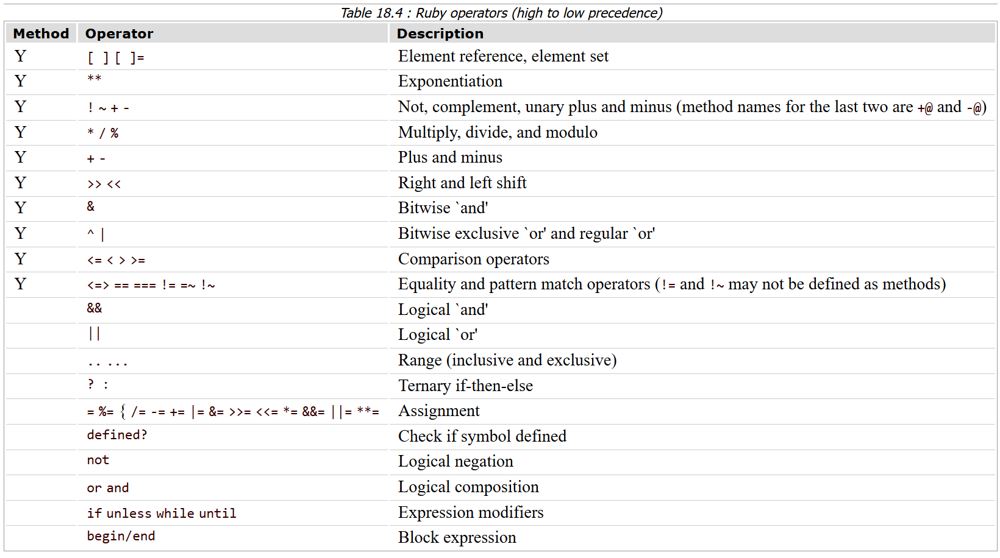

<h1 align="center"> Basic Ruby </h1>

# Introduction
Ruby is **very object-oriented** &rarr; Everything in Ruby is an **object**, even the most basic data types: numbers (integers and floats), strings, symbols, and Booleans (true, false, and nil).

For all of the examples throughout this lesson, feel free to follow along in irb or replit.com (an online REPL environment) to get a better feel for how they work.

# Lesson overview
This section contains a general overview of topics that you will learn in this lesson.

- List the basic arithmetic operators and what they do.
- Describe the difference between an integer and a float and how to convert between the two.
- Explain string interpolation and concatenation.
- Describe what escape characters are, and list several examples.
- Define what a symbol is and how it differs from a string.
- Explain what the Booleans true, false, and nil represent.

# Numbers & Operations

You probably already know what numbers are, so there’s no need to go into elaborate metaphors here. Ruby has all the typical math operators you would expect:

## Addition
1 + 1   #=> 2

## Subtraction
2 - 1   #=> 1

## Multiplication
2 * 2   #=> 4

## Division
10 / 5  #=> 2

## Exponent
2 ** 2  #=> 4

3 ** 4  #=> 81

## Modulus (find the remainder of division)
8 % 2   #=> 0  (8 / 2 = 4; no remainder)

10 % 4  #=> 2  (10 / 4 = 2 with a remainder of 2)

# Integers and floats
There are two main types of numbers in Ruby. Integers are whole numbers, such as 10. Floats are numbers that contain a decimal point, such as 10.5, 10.0, or 0.25.

When doing **arithmetic with two integers** in Ruby, the result will always be an **integer**.

17 / 5    #=> 3, not 3.4

To obtain an accurate answer, just replace one of the integers in the expression with a float.

17 / 5.0  #=> 3.4

Converting number types
Ruby makes it very easy to convert floats to integers and vice versa.

## To convert an integer to a float: .to_f
13.to_f   #=> 13.0

## To convert a float to an integer: .to_i
13.0.to_i #=> 13
13.9.to_i #=> 13
As shown in the last example above, when Ruby converts a float to an integer, the decimal places are cut off. 

Ruby **doesn’t do any rounding** in this conversion.

# Some useful number methods
There are many useful methods for numbers built into Ruby. For example,

## even?
6.even? #=> true

7.even? #=> false

## odd?

6.odd? #=> false

7.odd? #=> true

# Strings
Strings, strings, wonderful things, use them well and…your app will…grow wings? Or something.

At first glance, you might think that strings are just a bunch of characters that aren’t very useful beyond getting user input and outputting some information to the screen, but like Burt Reynolds passing up the chance to play Han Solo, you’d be wrong. Very wrong. What were you thinking, Burt?

## Double and single quotation marks
Strings can be formed with **either double "" or single'' quotation marks**, also known as **string literals**. 
- However, **string interpolation** and the **escape characters** that we’ll discuss soon both only work inside **double quotation marks**, not single quotation marks.

## Concatenation

In true Ruby style, there are plenty of ways to concatenate strings.

### With the plus [+] operator:
"Welcome " + "to " + "Odin!"    #=> "Welcome to Odin!"

### With the shovel [<<] operator:
"Welcome " << "to " << "Odin!"  #=> "Welcome to Odin!"

### With the concat [ s1.concat(s2) ] method:
"Welcome ".concat("to ").concat("Odin!")  #=> "Welcome to Odin!"

Classic Ruby!

## Substrings
You can access strings inside strings. Stringception! It’s super easy, too.

"hello"[0]      #=> "h"

"hello"[0..1]   #=> "he"

"hello"[0, 4]   #=> "hell"

"hello"[-1]     #=> "o"

In the above example we can access the individual characters of a string by referencing the index(es) of the character within the string using **[]**. For more information on the topic you can read the **#slice** method documentation.

## Escape characters (only in double quotation marks)
Escape characters allow you to type in representations of **whitespace characters** and to include **quotation marks** inside your string without accidentally ending it. As a reminder, escape characters only work inside **double quotation marks**.

\\  #=> Need a backslash in your string?

\b  #=> Backspace

\r  #=> Carriage return, for those of you that love typewriters

\n  #=> Newline. You'll likely use this one the most.

\s  #=> Space

\t  #=> Tab

\"  #=> Double quotation mark

\'  #=> Single quotation mark

The best thing to do is play around with them in irb or a REPL.

irb(main):001:0> puts "Hello \n\nHello"
Hello

Hello
=> nil

## Interpolation
String interpolation allows you to evaluate a string that contains placeholder variables. This is a very useful and common technique, so you will likely find yourself using this often. Be sure to use double quotes so that string interpolation will work!

name = "Odin"

puts "Hello, #{name}" #=> "Hello, Odin"
puts 'Hello, #{name}' #=> "Hello, #{name}"

## Common string methods
There are many useful string methods that are built into Ruby. You need to capitalize a word? No problem! Reverse a string? Easy peasy. Extract the binary subatomic algorithm from any regex grep? We don’t know, but since this is Ruby, let’s go with YES.

Just remember, strings have loads of methods provided to you for free, and you can find them all in the Ruby docs for the String class. If you’re working with strings and need to do something, check the Ruby docs first and see if there’s a method that does it for you.

Below is a quick recap of the more common string methods you might find yourself using:

#capitalize

"hello".capitalize #=> "Hello"
#include?

"hello".include?("lo")  #=> true

"hello".include?("z")   #=> false
#upcase

"hello".upcase  #=> "HELLO"
#downcase

"Hello".downcase  #=> "hello"
#empty?

"hello".empty?  #=> false

"".empty?       #=> true
#length

"hello".length  #=> 5
#reverse

"hello".reverse  #=> "olleh"
#split

"hello world".split  #=> ["hello", "world"]

"hello".split("")    #=> ["h", "e", "l", "l", "o"]
#strip

" hello, world   ".strip  #=> "hello, world"
You’ll read more about these methods and others in the assignment. The examples below are just to get your creative juices flowing with some of the awesome ways you can modify strings.

"he77o".sub("7", "l")           #=> "hel7o"

"he77o".gsub("7", "l")          #=> "hello"

"hello".insert(-1, " dude")     #=> "hello dude"

"hello world".delete("l")       #=> "heo word"

"!".prepend("hello, ", "world") #=> "hello, world!"
The assignments will go much deeper, so go through them thoroughly and be sure to play around in a REPL as you read.

## Converting other objects to strings
Using the **to_s** method, you can convert pretty much anything to a string. Here are some examples:

5.to_s        #=> "5"

nil.to_s      #=> ""

:symbol.to_s  #=> "symbol"

# Symbols
Symbols are an interesting twist on the idea of a string. The full explanation can be a bit long, but here’s the short version:

Strings can be changed, so every time a string is used, Ruby has to store it in memory even if an existing string with the same value already exists. Symbols, on the other hand, are stored in memory only once, making them faster in certain situations.

One common application where symbols are preferred over strings are the keys in hashes. We’ll cover this in detail in the hashes lesson later in the course.

You won’t need to use symbols much in the beginning, but it’s good to get familiar with what they are and what they look like so that you can recognize them.

## Create a symbol
To create a symbol, put a colon at the beginning of some text:

:my_symbol

## Symbols vs. strings
To get a better idea of how symbols are stored in memory, give this a whirl in irb or a REPL. The #object_id method returns an integer identifier for an object. (And remember: in Ruby, everything is an object!)

"string" == "string"  #=> true

"string".object_id == "string".object_id  #=> false

:symbol.object_id == :symbol.object_id    #=> true

# Booleans
You will learn about these data types in more detail in the Conditional Logic lesson later in this course. The goal of this lesson is for you to get a basic understanding of what Booleans are.

## True and false
The Boolean values true and false represent exactly what you think they do: true represents something that is true, and false represents something that is false.

# Nil
In Ruby, nil represents “nothing”. 
- Everything in Ruby has a **return value**. When a piece of code doesn’t have anything to return, it will return nil. 

# Knowledge check - Basic Data Types
The following questions are an opportunity to reflect on key topics in this lesson. If you can’t answer a question, click on it to review the material, but keep in mind you are not expected to memorize or master this knowledge.

1. What are the basic arithmetic operators you can use on numbers? 
    - +, -, *, /, **, %

1. What’s the difference between an integer and a float? 
    - Integers are whole numbers, floats have decimal points.

1. What method would you use to convert a float to an integer?
    - .to_i

1. What method would you use to convert an integer to a float?
    - .to_f
1. What is a string?
    - Collection of characters surrounded by either single or double quotes. 
1. What are the differences between single and double quotes?
    - String interpolations and escape characters only work on double quoted strings.
1. What is string interpolation?
    - String interpolation allows the evaluation of strings with placeholder values.
1. How do you concatenate strings?
    - +, <<, .concat
1. What method would you use to change all the characters in your string to upper case?
    - .upper
1. What method would you use to split up strings into arrays?
    - split(")
1. What are escape characters?
    - Special characters that need to be prepended by \ in order to have them appear as they are in strings.
1. How do you access a specific character or substring?
    - "my_string"[i]
    - "my_string"[i .. i+n]
    - "my_string"[i, j]
    - "my_string"[-1]
1. How do you convert other data types into strings?
    - .to_s &rarr; nil.to_s => "", :symbol.to_s => "symbol"
1. What is a symbol?
    - Symbols are similar to strings, but are only stored in memory once. That is, when a symbol is used, Ruby does not store in memory if one already exists.
1. How do you create a symbol?
    - :my_symbol
1. What’s the difference between a symbol and a string?
    - Symbols are similar to strings, but are only stored in memory once.
        - "string".object_id == "string".object_id => false
        - :symbol.object_id == :symbol.object_id   => true

1. What does true represent?
    - things that are true
1. What does false represent?
    - things that are false
1. What does nil represent?
    - Abstract, but it serves as the return value of a piece of code that does not have a return value when evaluated (i.e. puts)

# Additional resources 
https://www.theodinproject.com/lessons/ruby-basic-data-types

<h1 align="center"> Variables</h1>

**Variables are references**.

The information you name with a variable is stored in memory on your computer, so a **variable** is effectively a **reference or a pointer** to that **address in memory**. This is important to know as it can sometimes be the cause of unexpected behavior from your code.

Let’s look at an example of this unexpected behavior, with two variables:
- **desired_location** is assigned to the string “Barcelona”
- **johns_location** is assigned to the **desired_location** variable. 

Both variables are pointing to where **“Barcelona”** is stored in memory.

Observe what happens when **“Barcelona”** that is stored in memory is modified:

desired_location = "Barcelona"

johns_location = desired_location

desired_location  #=> "Barcelona"

johns_location    #=> "Barcelona"

johns_location.upcase!  #=> "BARCELONA"

**desired_location      #=> "BARCELONA"**

johns_location          #=> "BARCELONA"

Here,  the **upcase!** method was used instead of the safe **upcase** method.
- If the string is modified using **johns_location.upcase!** then **desired_location** will also reflect that change.

Point being, be aware that variables are references, and that some methods may or may not affect the referenced memory address location.

<h1 align="center"> Input and Output</h1>

# Output: puts vs. print
**puts** *puts* and extra newline at the end of its output; **print** does not.

Observe the example below. It uses the semicolon which allows you to run multiple Ruby commands on one line.
- Generally this type of [code golf]() is not receommended, but helpful in this case.
- In a REPL like replit.com, you don't need the semicolons and it will be able to produce the desired output.
- The **irb**, however, requires the semicolons since it can only read one statement at a time.

## print
irb(main):001:0> print "Hello World"; print "I love drinking coffee"

Hello WorldI love drinking coffee=> nil

## puts
irb(main):002:0> puts "Hello World"; puts "I love drinking coffee"

Hello World

I love drinking coffee

=> nil

# Input
## gets
The gets command to accepts user input, during which **program execution will stop** and await user input. The program continues its execution after the user presses **Enter**.

Note that **gets** returns the **user input** instead of nil, which is convenient as it can be immediately assigned to a variable for later use.

Also, **gets** always returns a new line at the end of input.
- **#chomp** is a method commonly used to trim separators. That is, **gets.chomp** will obtain the user input without appending a trailing newline character.

<h1 align="center"> Conditional Logic</h1>

# Overview
 - **Falsy** values
 - if, elsif, else
 - if vs. unless
 - ||, &&, !
 - Short circuit evaluation
 - Ternary operator
 - Case statements

# Falsy Values

 In Ruby, everything except for **nil** and **false** are considered **true**.
 
 &rarr; 0 and "" do not evaluate to false!

 # if, elsif, else

## Basic Example
if attack_by_land == true  
&ensp;&ensp; puts "release the goat"  
elsif attack_by_sea == true  
&ensp;&ensp; puts "release the shark"  
else  
&ensp;&ensp; puts "release Kevin the octopus"  
end

- There is one **end** in an if .. elsif .. else block.

## One-line ifs
puts "Hot diggity damn, 1 is less than 2" **if 1 < 2** 
- Note the lack of **end** statement as well.

# Boolean Logic  
== &rarr; returns true if values compared are equal.

!= &rarr; returns true if values compared are not equal.

\>, <, >=, <= &rarr; work as expected

**#eql?** &rarr; Checks both the value **type** and the **actual value** it holds.
- 5.eql?(5.0) &rarr; false; although they are the same value, one is an integer and the other is a float  
- 5.eql?(5)   #=> true

**#equal?** &rarr; Checks if both values are **exactly the same object in memory**.
### Contrast:  
a = 5  
b = 5  
a.equal?(b) &rarr; true

### and:
a = "hello"  
b = "hello"  
a.equal?(b) #=> false

- Recall that strings that are appear the same are still created as two separate string objects in memory.

# Spaceship Operator <=> (LvR)
Most commonly used in **sorting functions**, <=> returns one of three numerical values:  
- -1 if the value on the left is less than the value on the right;
- 0 if the value on the left is equal to the value on the right; and
- 1 if the value on the left is greater than the value on the right.

## Examples 
- 5 <=> 10    #=> -1
- 10 <=> 10   #=> 0
- 10 <=> 5    #=> 1

# Logical Operators
## [Operator Precedence Table in Ruby](https://phrogz.net/programmingruby/language.html#table_18.4)
   - 
   
   - Most importantly, though, **and** and **or** logical operators are factored in **after** assignment.

## ANDs (&&, and) and ORs (||, or)
- The **and** and && operators evaluate their first operand. If false, the expression returns false; otherwise, the expression returns the value of the second operand.
- The **or** and || operators evaluate their first operand. If true, the expression returns true; otherwise, the expression returns the value of the second operand.

The differences will be illustrated below.

### || and &&, "or" and "and" Examples 
nil || 42 &rarr; 42  
42 && 23 &rarr; 23

nil **or** 42 &rarr; 42  
42 **and** 23 &rarr; 23

### && vs. and
user = Struct.new(:name).new("Avdi")  
user_name = user && user.name  
\# user_name &rarr; "Avdi"

user = Struct.new(:name).new("Avdi")  
user_name = user **and** user.name
\# user_name &rarr; "\# \<struct name="Avdi"\>

This is because of their operator precedence, as highlighted below:  
- user_name = (user && user.name)  
- (user_name = user) and user.name

### || vs. or
:x || :y && nil \# &rarr; :x  
:x **or** :y **and** nil \# &rarr; :nil

because:
- :x || (:y && nil) \# &rarr; :x, && takes priority over ||.  
- (:x **or** :y) **and** nil \# &rarr; :nil, **or** and **and** have the same precedence.

# Case Statements
Can be much more compact than a whole bunch of if...elsif statements. You can even **assign the return value** to a variable for use later.

## Example
grade = 'F'

did_i_pass = **case** grade #=> create a variable `did_i_pass` and assign the result of a call to case with the variable grade passed in   
&emsp;**when** 'A' **then** "Hell yeah!"  
&emsp;**when** 'D' **then** "Don't tell your mother."  
&emsp;**else** "'YOU SHALL NOT PASS!' -Gandalf"  
**end**

\# In case you wanted multiple lines of code between when statements, simply drop the then:

grade = 'F'

did_i_pass = **case** grade #=> create a variable `did_i_pass` and assign the result of a call to case with the variable grade passed in   
&emsp;**when**  
&emsp;&emsp;puts "You're a genius"  
&emsp;&emsp;future_bank_account_balance = 5_000_000  
&emsp;**when** 'D'   
&emsp;&emsp;puts "Better luck next time"  
&emsp;&emsp;can_i_retire_soon = false    
&emsp;**else**   
&emsp;&emsp;puts"'YOU SHALL NOT PASS!' -Gandalf"  
&emsp;&emsp;fml = true   
&emsp;**end**

# Unless Statements
An unless statement works in the **opposite** way as an **if** statement: it only processes the code in the block if the expression evaluates to false.
- Use the **unless** statement when you want to **not** do something if a condition is true. It's more readable than **if !true**

## Example
age = 19  
puts "Welcome to a life of debt." **unless** age < 18

**unless** age < 18  
&emsp;puts "Down with that sort of thing."  
else  
&emsp;puts "Careful now!"  
end

# Ternary Operator
**if...else** in one line!
- Its syntax is **condition** ? \<execute if true> : \<execute if false>. 
- You can assign the return value of the expression to a variable.

## Example
age = 19  
response = **age < 18** ? **"You still have your entire life ahead of you."** : **"You're all grown up."**  
puts response #=> "You're all grown up."

### An equivalent but much more verbose **if...else**
age = 19  
if age < 18  
&emsp;response = "You still have your entire life ahead of you."  
else  
&emsp;response = "You're all grown up."  
end

puts response #=> "You're all grown up."

<h1 align="center"> Loops </h1>

## Overview
- Explain what a loop is and why it’s useful.  
- Explain what a **loop** loop is and how to use it.  
- Explain what a **while** loop is and how to use it.  
- Explain what a **for** loop is and how to use it.  
- Explain what a **#times** loop is and how to use it.  
- Explain what an **until** loop is and how to use it.  
- Explain what **#upto** and **#downto** loops are and how to use them.

# Loop
The **loop** loops are infinite loops that will keep going until you request for it to stop using the **break** command (typically used with a condition).

i = 0  
loop do  
&emsp;puts "i is #{i}"  
&emsp;i += 1  
&emsp;break if i == 10  
end

# While loop
The **while** loops are similar to the **loop** loops except that you declare the condition that will break out of the loop up front.

i = 0  
while i < 10 do    
&emsp;puts "i is #{i}"  
&emsp;i += 1  
end

You can also use while loops to wait for a particular response:  

while gets.chomp != "yes" do  
&emsp;puts "Are we there yet?"  
end

# Until loop
The **until** loop is the opposite of the **while** loop. A **while** loop continues for as long as the condition is **true**, whereas an **until** loop continues for as long as the condition is **false**. These two loops can therefore be used pretty much interchangeably. 
- The **break** condition will determine which one is more readable. (i.e. avoid **nots** in the conditions)

Rewriting our **while** loops into **until** loops:  

i = 0  
until i >= 10 do  
&emsp;puts "i is #{i}"  
&emsp;i += 1  
end

Also: 

until gets.chomp == "yes" do  
&emsp;puts "Do you like Pizza?"  
end

# Ranges
Ranges define an **interval**.

Ranges can be **exclusive or inclusive**
- (1..5)      # inclusive range: 1, 2, 3, 4, 5  
- (1...5)     # exclusive range: 1, 2, 3, 4  

We can make ranges of letters, too!
- ('a'..'d')  # a, b, c, d

# For loop
A **for** loop is used to iterate through a collection of information such as an array or range. These loops are useful if you need to do something a given number of times while also using an iterator.

for i in 0..5  
&emsp;puts "#{i} zombies incoming!"
end

# Times loop
Use this to run a loop for **specified** number of times.
- It also accesses the number it's currently iterating through, starting from a **zero index**.

5.times do  
&emsp;puts "Hello, world!"  
end

5.times do |number|  
&emsp;puts "Alternative fact number #{number}"
end

# Upto and Downto loops
The Ruby methods **#upto** and **#downto** do exactly what you’d think they do from their names. You can use these methods to iterate **from a starting number** either up to or down **to another number**, respectively.
- Both **upto** and **downto** include the **boundaries** of the specified range.

5.**upto(10)** { |num| print "#{num} " }     #=> 5 6 7 8 9 10

10.**downto(5)** { |num| print "#{num} " }   #=> 10 9 8 7 6 5

If you need to step through a series of numbers (or even letters) within a specific range, then these are the loops for you.

<h1 align="center"> Arrays </h1>

# Creating Arrays
- Arrays are commonly created using an **array literal**, a special syntax used to create instances of an array object. &rarr; []  
- Alternatively, call the **Array.new** method, which can also take up to 2 optional arguments (initial size, default value).
## Examples
num_array = [1, 2, 3, 4, 5]  
str_array = ["This", "is", "a", "small", "array"]

Array.new               #=> []  
Array.new(3)            #=> [nil, nil, nil]  
Array.new(3, 7)         #=> [7, 7, 7]  
Array.new(3, true)      #=> [true, true, true]  

# Accessing Elements
- Zero-based indexing.
- my_array[i]  

str_array = ["This", "is", "a", "small", "array"]

str_array[0]            #=> "This"  
str_array[1]            #=> "is"  
str_array[4]            #=> "array"  
str_array[-1]           #=> "array"  
str_array[-2]           #=> "small"

- or use the **#first** and **#last** methods, which can optionally take an integer argument to give you the first or last n elements respectively: 

str_array.first         #=> "This"  
str_array.first(2)      #=> ["This", "is"]  
str_array.last(2)       #=> ["small", "array"]  

# Adding and Removing Elements: Push and Pop!
- The **#push** or **shovel <<** operator both **add elements** to the **end of an array** and return that **array** with new elements.
- The **#pop** method will remove the element at the **end** of the array and return the **element that was removed**.

## Push & Pop Examples: End of an Array
num_array = [1, 2]  

num_array.push(3, 4)      #=> [1, 2, 3, 4]  
num_array << 5            #=> [1, 2, 3, 4, 5]  
num_array.pop             #=> 5  
num_array                 #=> [1, 2, 3, 4]  

## Shift and Unshift: Beginning of an Array
- Working similarly to **#push** and **#pop** and returning the **resulting array** and **removed element** respectively, **#shift** and **#unshift** instead operate on the beginning of an array.

num_array = [2, 3, 4]  

num_array.unshift(1)      #=> [1, 2, 3, 4]  
num_array.shift           #=> 1  
num_array                 #=> [2, 3, 4]  

Note that both **#pop** and **#shift** can take integer arguments, and will return **in-order** removed elements in an **array** instead.

num_array = [1, 2, 3, 4, 5, 6]

num_array.pop(3)          #=> [4, 5, 6]  
num_array.shift(2)        #=> [1, 2]  
num_array                 #=> [3]  

# Adding and Subtracting Arrays
- Use the **+** operator or the **#concat** method to combine arrays, both of which return the resulting concatenated array.

a = [1, 2, 3]  
b = [3, 4, 5]

a + b         #=> [1, 2, 3, 3, 4, 5]  
a.concat(b)   #=> [1, 2, 3, 3, 4, 5]
- You can also find the difference between two arrays using the **-** operator (i.e. A - B), working similar to set substraction where the results is an array of elements in A that are not in B. Effectively, just removes elmments that are in A but not in B.

[1, 1, 1, 2, 2, 3, 4] - [1, 4]  #=> [2, 2, 3]

# Basic Array Methods
- **empty?, length, reverse, include?, join**
- Go to [Other Array Methods](https://docs.ruby-lang.org/en/3.3/Array.html) or my_array_name.methods (very long list of methods).

[].empty?               #=> true  
[[]].empty?             #=> false  
[1, 2].empty?           #=> false  

[1, 2, 3].length        #=> 3  

[1, 2, 3].reverse       #=> [3, 2, 1]  
  
[1, 2, 3].include?(3)   #=> true  
[1, 2, 3].include?("3") #=> false  

[1, 2, 3].join          #=> "123"  
[1, 2, 3].join("-")     #=> "1-2-3" 

<h1 align="center"> Hashes </h1>
Hashes in Ruby: keys and values!

# Creating Hashes
Use the curly braces **{}**, but besides that it's open season!
- Mix up key and value types as you please!

my_hash = {
  "a random word" => "ahoy",  
  "Dorothy's math test score" => 94,  
  "an array" => [1, 2, 3],  
  "an empty hash within a hash" => {}  
}

hash = { 9 => "nine", :six => 6 }

OR:

my_hash = Hash.new  
my_hash               #=> {}
# Accessing Values
Access elements in a Hash like you would elements in an array!

shoes = {  
&emsp; "summer" => "sandals",  
&emsp; "winter" => "boots"  
}

shoes["summer"]   #=> "sandals"

Note that accessing keys that don't exist in the hash will result in **nil**.
- Since this behavior in returning nil may wreak havoc in your program, use the **fetch** method that will **raise** a **KeyError** when you try to access a key not in the hash.
- The **fetch** method can also return a default value instead of raising an error if the given key is not found.

shoes.fetch("hiking")   #=> KeyError: key not found: "hiking"  
shoes.fetch("hiking", "hiking boots") #=> "hiking boots"

# Adding and Changing Data
- Add and change data in a hash like you would in an array: **my_hash[key_name] = new_value**

shoes["fall"] = "sneakers"  
shoes     #=> {"summer"=>"sandals", "winter"=>"boots", "fall"=>"sneakers"}

shoes["summer"] = "flip-flops"  
shoes     #=> {"summer"=>"flip-flops", "winter"=>"boots", "fall"=>"sneakers"}

# Removing Data
- Remove data from a hash using the **#delete** method.

shoes.delete("summer")    #=> "flip-flops"  
shoes                     #=> {"winter"=>"boots", "fall"=>"sneakers"}

# Methods
- Hashes respond to many of the same methods as arrays since they both employ Ruby's **Enumerable** module &rarr; we'll explore more later.
- The **#keys** and **#values** methods are particularly useful, and they return the keys and values of a hash respectively as **arrays**.

books = {  
&emsp;"Infinite Jest" => "David Foster Wallace",  
&emsp;"Into the Wild" => "Jon Krakauer"  
}

books.keys      #=> ["Infinite Jest", "Into the Wild"]  
books.values    #=> ["David Foster Wallace", "Jon Krakauer"]

# Merging Two Hashes
- Use the **#merge** function to (surprise!) merge two hashes.
- Note that elements which share the **same keys** between hashes will take the value of the **second** hash.

hash1 = { "a" => 100, "b" => 200 }  
hash2 = { "b" => 254, "c" => 300 }  
hash1.merge(hash2)      #=> { "a" => 100, "b" => 254, "c" => 300 }

# Symbols as Hash Keys
- As before, **symbols** are much more performant than strings in Ruby, and they also allow for a much cleaner syntax when defining hashes.

\# 'Rocket' syntax  
american_cars = {  
&emsp;:chevrolet => "Corvette",  
&emsp;:ford => "Mustang",   
&emsp;:dodge => "Ram"  
}

\# 'Symbols' syntax
japanese_cars = {  
&emsp;honda: "Accord",  
&emsp;toyota: "Corolla",  
&emsp;nissan: "Altima"  
}

- Note that this colon shorthand **only works for synbols**, so { 9: "value"} will get you a syntax error.
- Also, you will still need to access the values of symbol keys the same way:  

american_cars[:ford]    #=> "Mustang"  
japanese_cars[:honda]   #=> "Accord"

<h1 align="center"> Methods </h1>
<h1 align="center"> Debugging </h1>
<h1 align="center"> Basic Enumerable Methods </h1>
<h1 align="center"> Predicate Enumerable Methods </h1>
<h1 align="center"> Nested Collections </h1>