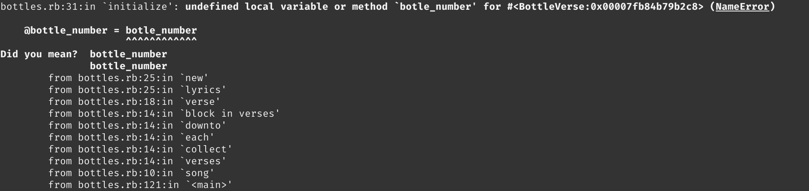

<h1 align="center"> Basic Ruby </h1>

# Introduction
Ruby is **very object-oriented** &rarr; Everything in Ruby is an **object**, even the most basic data types: numbers (integers and floats), strings, symbols, and Booleans (true, false, and nil).

For all of the examples throughout this lesson, feel free to follow along in irb or replit.com (an online REPL environment) to get a better feel for how they work.

# Lesson overview
This section contains a general overview of topics that you will learn in this lesson.

- List the basic arithmetic operators and what they do.
- Describe the difference between an integer and a float and how to convert between the two.
- Explain string interpolation and concatenation.
- Describe what escape characters are, and list several examples.
- Define what a symbol is and how it differs from a string.
- Explain what the Booleans true, false, and nil represent.

# Numbers & Operations

You probably already know what numbers are, so there’s no need to go into elaborate metaphors here. Ruby has all the typical math operators you would expect:

## Addition
1 + 1   #=> 2

## Subtraction
2 - 1   #=> 1

## Multiplication
2 * 2   #=> 4

## Division
10 / 5  #=> 2

## Exponent
2 ** 2  #=> 4

3 ** 4  #=> 81

## Modulus (find the remainder of division)
8 % 2   #=> 0  (8 / 2 = 4; no remainder)

10 % 4  #=> 2  (10 / 4 = 2 with a remainder of 2)

# Integers and floats
There are two main types of numbers in Ruby. Integers are whole numbers, such as 10. Floats are numbers that contain a decimal point, such as 10.5, 10.0, or 0.25.

When doing **arithmetic with two integers** in Ruby, the result will always be an **integer**.

17 / 5    #=> 3, not 3.4

To obtain an accurate answer, just replace one of the integers in the expression with a float.

17 / 5.0  #=> 3.4

Converting number types
Ruby makes it very easy to convert floats to integers and vice versa.

## To convert an integer to a float: .to_f
13.to_f   #=> 13.0

## To convert a float to an integer: .to_i
13.0.to_i #=> 13
13.9.to_i #=> 13
As shown in the last example above, when Ruby converts a float to an integer, the decimal places are cut off. 

Ruby **doesn’t do any rounding** in this conversion.

# Some useful number methods
There are many useful methods for numbers built into Ruby. For example,

## even?
6.even? #=> true

7.even? #=> false

## odd?

6.odd? #=> false

7.odd? #=> true

# Strings
Strings, strings, wonderful things, use them well and…your app will…grow wings? Or something.

At first glance, you might think that strings are just a bunch of characters that aren’t very useful beyond getting user input and outputting some information to the screen, but like Burt Reynolds passing up the chance to play Han Solo, you’d be wrong. Very wrong. What were you thinking, Burt?

## Double and single quotation marks
Strings can be formed with **either double "" or single'' quotation marks**, also known as **string literals**. 
- However, **string interpolation** and the **escape characters** that we’ll discuss soon both only work inside **double quotation marks**, not single quotation marks.

## Concatenation

In true Ruby style, there are plenty of ways to concatenate strings.

### With the plus [+] operator:
"Welcome " + "to " + "Odin!"    #=> "Welcome to Odin!"

### With the shovel [<<] operator:
"Welcome " << "to " << "Odin!"  #=> "Welcome to Odin!"

### With the concat [ s1.concat(s2) ] method:
"Welcome ".concat("to ").concat("Odin!")  #=> "Welcome to Odin!"

Classic Ruby!

## Substrings
You can access strings inside strings. Stringception! It’s super easy, too.

"hello"[0]      #=> "h"

"hello"[0..1]   #=> "he"

"hello"[0, 4]   #=> "hell"

"hello"[-1]     #=> "o"

In the above example we can access the individual characters of a string by referencing the index(es) of the character within the string using **[]**. For more information on the topic you can read the **#slice** method documentation.

## Escape characters (only in double quotation marks)
Escape characters allow you to type in representations of **whitespace characters** and to include **quotation marks** inside your string without accidentally ending it. As a reminder, escape characters only work inside **double quotation marks**.

\\  #=> Need a backslash in your string?

\b  #=> Backspace

\r  #=> Carriage return, for those of you that love typewriters

\n  #=> Newline. You'll likely use this one the most.

\s  #=> Space

\t  #=> Tab

\"  #=> Double quotation mark

\'  #=> Single quotation mark

The best thing to do is play around with them in irb or a REPL.

irb(main):001:0> puts "Hello \n\nHello"
Hello

Hello
=> nil

## Interpolation
String interpolation allows you to evaluate a string that contains placeholder variables. This is a very useful and common technique, so you will likely find yourself using this often. Be sure to use double quotes so that string interpolation will work!

name = "Odin"

puts "Hello, #{name}" #=> "Hello, Odin"
puts 'Hello, #{name}' #=> "Hello, #{name}"

## Common string methods
There are many useful string methods that are built into Ruby. You need to capitalize a word? No problem! Reverse a string? Easy peasy. Extract the binary subatomic algorithm from any regex grep? We don’t know, but since this is Ruby, let’s go with YES.

Just remember, strings have loads of methods provided to you for free, and you can find them all in the Ruby docs for the String class. If you’re working with strings and need to do something, check the Ruby docs first and see if there’s a method that does it for you.

Below is a quick recap of the more common string methods you might find yourself using:

#capitalize

"hello".capitalize #=> "Hello"
#include?

"hello".include?("lo")  #=> true

"hello".include?("z")   #=> false
#upcase

"hello".upcase  #=> "HELLO"
#downcase

"Hello".downcase  #=> "hello"
#empty?

"hello".empty?  #=> false

"".empty?       #=> true
#length

"hello".length  #=> 5
#reverse

"hello".reverse  #=> "olleh"
#split

"hello world".split  #=> ["hello", "world"]

"hello".split("")    #=> ["h", "e", "l", "l", "o"]
#strip

" hello, world   ".strip  #=> "hello, world"
You’ll read more about these methods and others in the assignment. The examples below are just to get your creative juices flowing with some of the awesome ways you can modify strings.

"he77o".sub("7", "l")           #=> "hel7o"

"he77o".gsub("7", "l")          #=> "hello"

"hello".insert(-1, " dude")     #=> "hello dude"

"hello world".delete("l")       #=> "heo word"

"!".prepend("hello, ", "world") #=> "hello, world!"
The assignments will go much deeper, so go through them thoroughly and be sure to play around in a REPL as you read.

## Converting other objects to strings
Using the **to_s** method, you can convert pretty much anything to a string. Here are some examples:

5.to_s        #=> "5"

nil.to_s      #=> ""

:symbol.to_s  #=> "symbol"

# Symbols
Symbols are an interesting twist on the idea of a string. The full explanation can be a bit long, but here’s the short version:

Strings can be changed, so every time a string is used, Ruby has to store it in memory even if an existing string with the same value already exists. Symbols, on the other hand, are stored in memory only once, making them faster in certain situations.

One common application where symbols are preferred over strings are the keys in hashes. We’ll cover this in detail in the hashes lesson later in the course.

You won’t need to use symbols much in the beginning, but it’s good to get familiar with what they are and what they look like so that you can recognize them.

## Create a symbol
To create a symbol, put a colon at the beginning of some text:

:my_symbol

## Symbols vs. strings
To get a better idea of how symbols are stored in memory, give this a whirl in irb or a REPL. The #object_id method returns an integer identifier for an object. (And remember: in Ruby, everything is an object!)

"string" == "string"  #=> true

"string".object_id == "string".object_id  #=> false

:symbol.object_id == :symbol.object_id    #=> true

# Booleans
You will learn about these data types in more detail in the Conditional Logic lesson later in this course. The goal of this lesson is for you to get a basic understanding of what Booleans are.

## True and false
The Boolean values true and false represent exactly what you think they do: true represents something that is true, and false represents something that is false.

# Nil
In Ruby, nil represents “nothing”. 
- Everything in Ruby has a **return value**. When a piece of code doesn’t have anything to return, it will return nil. 

# Knowledge check - Basic Data Types
The following questions are an opportunity to reflect on key topics in this lesson. If you can’t answer a question, click on it to review the material, but keep in mind you are not expected to memorize or master this knowledge.

1. What are the basic arithmetic operators you can use on numbers? 
    - +, -, *, /, **, %

1. What’s the difference between an integer and a float? 
    - Integers are whole numbers, floats have decimal points.

1. What method would you use to convert a float to an integer?
    - .to_i

1. What method would you use to convert an integer to a float?
    - .to_f
1. What is a string?
    - Collection of characters surrounded by either single or double quotes. 
1. What are the differences between single and double quotes?
    - String interpolations and escape characters only work on double quoted strings.
1. What is string interpolation?
    - String interpolation allows the evaluation of strings with placeholder values.
1. How do you concatenate strings?
    - +, <<, .concat
1. What method would you use to change all the characters in your string to upper case?
    - .upper
1. What method would you use to split up strings into arrays?
    - split(")
1. What are escape characters?
    - Special characters that need to be prepended by \ in order to have them appear as they are in strings.
1. How do you access a specific character or substring?
    - "my_string"[i]
    - "my_string"[i .. i+n]
    - "my_string"[i, j]
    - "my_string"[-1]
1. How do you convert other data types into strings?
    - .to_s &rarr; nil.to_s => "", :symbol.to_s => "symbol"
1. What is a symbol?
    - Symbols are similar to strings, but are only stored in memory once. That is, when a symbol is used, Ruby does not store in memory if one already exists.
1. How do you create a symbol?
    - :my_symbol
1. What’s the difference between a symbol and a string?
    - Symbols are similar to strings, but are only stored in memory once.
        - "string".object_id == "string".object_id => false
        - :symbol.object_id == :symbol.object_id   => true

1. What does true represent?
    - things that are true
1. What does false represent?
    - things that are false
1. What does nil represent?
    - Abstract, but it serves as the return value of a piece of code that does not have a return value when evaluated (i.e. puts)

# Additional resources 
https://www.theodinproject.com/lessons/ruby-basic-data-types

<h1 align="center"> Variables</h1>

**Variables are references**.

The information you name with a variable is stored in memory on your computer, so a **variable** is effectively a **reference or a pointer** to that **address in memory**. This is important to know as it can sometimes be the cause of unexpected behavior from your code.

Let’s look at an example of this unexpected behavior, with two variables:
- **desired_location** is assigned to the string “Barcelona”
- **johns_location** is assigned to the **desired_location** variable. 

Both variables are pointing to where **“Barcelona”** is stored in memory.

Observe what happens when **“Barcelona”** that is stored in memory is modified:

desired_location = "Barcelona"

johns_location = desired_location

desired_location  #=> "Barcelona"

johns_location    #=> "Barcelona"

johns_location.upcase!  #=> "BARCELONA"

**desired_location      #=> "BARCELONA"**

johns_location          #=> "BARCELONA"

Here,  the **upcase!** method was used instead of the safe **upcase** method.
- If the string is modified using **johns_location.upcase!** then **desired_location** will also reflect that change.

Point being, be aware that variables are references, and that some methods may or may not affect the referenced memory address location.

<h1 align="center"> Input and Output</h1>

# Output: puts vs. print
**puts** *puts* and extra newline at the end of its output; **print** does not.

Observe the example below. It uses the semicolon which allows you to run multiple Ruby commands on one line.
- Generally this type of [code golf]() is not receommended, but helpful in this case.
- In a REPL like replit.com, you don't need the semicolons and it will be able to produce the desired output.
- The **irb**, however, requires the semicolons since it can only read one statement at a time.

## print
irb(main):001:0> print "Hello World"; print "I love drinking coffee"

Hello WorldI love drinking coffee=> nil

## puts
irb(main):002:0> puts "Hello World"; puts "I love drinking coffee"

Hello World

I love drinking coffee

=> nil

# Input
## gets
The gets command to accepts user input, during which **program execution will stop** and await user input. The program continues its execution after the user presses **Enter**.

Note that **gets** returns the **user input** instead of nil, which is convenient as it can be immediately assigned to a variable for later use.

Also, **gets** always returns a new line at the end of input.
- **#chomp** is a method commonly used to trim separators. That is, **gets.chomp** will obtain the user input without appending a trailing newline character.

<h1 align="center"> Conditional Logic</h1>

# Overview
 - **Falsy** values
 - if, elsif, else
 - if vs. unless
 - ||, &&, !
 - Short circuit evaluation
 - Ternary operator
 - Case statements

# Falsy Values

 In Ruby, everything except for **nil** and **false** are considered **true**.
 
 &rarr; 0 and "" do not evaluate to false!

 # if, elsif, else

## Basic Example
if attack_by_land == true  
&ensp;&ensp; puts "release the goat"  
elsif attack_by_sea == true  
&ensp;&ensp; puts "release the shark"  
else  
&ensp;&ensp; puts "release Kevin the octopus"  
end

- There is one **end** in an if .. elsif .. else block.

## One-line ifs
puts "Hot diggity damn, 1 is less than 2" **if 1 < 2** 
- Note the lack of **end** statement as well.

# Boolean Logic  
== &rarr; returns true if values compared are equal.

!= &rarr; returns true if values compared are not equal.

\>, <, >=, <= &rarr; work as expected

**#eql?** &rarr; Checks both the value **type** and the **actual value** it holds.
- 5.eql?(5.0) &rarr; false; although they are the same value, one is an integer and the other is a float  
- 5.eql?(5)   #=> true

**#equal?** &rarr; Checks if both values are **exactly the same object in memory**.
### Contrast:  
a = 5  
b = 5  
a.equal?(b) &rarr; true

### and:
a = "hello"  
b = "hello"  
a.equal?(b) #=> false

- Recall that strings that are appear the same are still created as two separate string objects in memory.

# Spaceship Operator <=> (LvR)
Most commonly used in **sorting functions**, <=> returns one of three numerical values:  
- -1 if the value on the left is less than the value on the right;
- 0 if the value on the left is equal to the value on the right; and
- 1 if the value on the left is greater than the value on the right.

## Examples 
- 5 <=> 10    #=> -1
- 10 <=> 10   #=> 0
- 10 <=> 5    #=> 1

# Logical Operators
## [Operator Precedence Table in Ruby](https://phrogz.net/programmingruby/language.html#table_18.4)
   - 
   
   - Most importantly, though, **and** and **or** logical operators are factored in **after** assignment.

## ANDs (&&, and) and ORs (||, or)
- The **and** and && operators evaluate their first operand. If false, the expression returns false; otherwise, the expression returns the value of the second operand.
- The **or** and || operators evaluate their first operand. If true, the expression returns true; otherwise, the expression returns the value of the second operand.

The differences will be illustrated below.

### || and &&, "or" and "and" Examples 
nil || 42 &rarr; 42  
42 && 23 &rarr; 23

nil **or** 42 &rarr; 42  
42 **and** 23 &rarr; 23

### && vs. and
user = Struct.new(:name).new("Avdi")  
user_name = user && user.name  
\# user_name &rarr; "Avdi"

user = Struct.new(:name).new("Avdi")  
user_name = user **and** user.name
\# user_name &rarr; "\# \<struct name="Avdi"\>

This is because of their operator precedence, as highlighted below:  
- user_name = (user && user.name)  
- (user_name = user) and user.name

### || vs. or
:x || :y && nil \# &rarr; :x  
:x **or** :y **and** nil \# &rarr; :nil

because:
- :x || (:y && nil) \# &rarr; :x, && takes priority over ||.  
- (:x **or** :y) **and** nil \# &rarr; :nil, **or** and **and** have the same precedence.

# Case Statements
Can be much more compact than a whole bunch of if...elsif statements. You can even **assign the return value** to a variable for use later.

## Example
grade = 'F'

did_i_pass = **case** grade #=> create a variable `did_i_pass` and assign the result of a call to case with the variable grade passed in   
&emsp;**when** 'A' **then** "Hell yeah!"  
&emsp;**when** 'D' **then** "Don't tell your mother."  
&emsp;**else** "'YOU SHALL NOT PASS!' -Gandalf"  
**end**

\# In case you wanted multiple lines of code between when statements, simply drop the then:

grade = 'F'

did_i_pass = **case** grade #=> create a variable `did_i_pass` and assign the result of a call to case with the variable grade passed in   
&emsp;**when**  
&emsp;&emsp;puts "You're a genius"  
&emsp;&emsp;future_bank_account_balance = 5_000_000  
&emsp;**when** 'D'   
&emsp;&emsp;puts "Better luck next time"  
&emsp;&emsp;can_i_retire_soon = false    
&emsp;**else**   
&emsp;&emsp;puts"'YOU SHALL NOT PASS!' -Gandalf"  
&emsp;&emsp;fml = true   
&emsp;**end**

# Unless Statements
An unless statement works in the **opposite** way as an **if** statement: it only processes the code in the block if the expression evaluates to false.
- Use the **unless** statement when you want to **not** do something if a condition is true. It's more readable than **if !true**

## Example
age = 19  
puts "Welcome to a life of debt." **unless** age < 18

**unless** age < 18  
&emsp;puts "Down with that sort of thing."  
else  
&emsp;puts "Careful now!"  
end

# Ternary Operator
**if...else** in one line!
- Its syntax is **condition** ? \<execute if true> : \<execute if false>. 
- You can assign the return value of the expression to a variable.

## Example
age = 19  
response = **age < 18** ? **"You still have your entire life ahead of you."** : **"You're all grown up."**  
puts response #=> "You're all grown up."

### An equivalent but much more verbose **if...else**
age = 19  
if age < 18  
&emsp;response = "You still have your entire life ahead of you."  
else  
&emsp;response = "You're all grown up."  
end

puts response #=> "You're all grown up."

<h1 align="center"> Loops </h1>

## Overview
- Explain what a loop is and why it’s useful.  
- Explain what a **loop** loop is and how to use it.  
- Explain what a **while** loop is and how to use it.  
- Explain what a **for** loop is and how to use it.  
- Explain what a **#times** loop is and how to use it.  
- Explain what an **until** loop is and how to use it.  
- Explain what **#upto** and **#downto** loops are and how to use them.

# Loop
The **loop** loops are infinite loops that will keep going until you request for it to stop using the **break** command (typically used with a condition).

i = 0  
loop do  
&emsp;puts "i is #{i}"  
&emsp;i += 1  
&emsp;break if i == 10  
end

# While loop
The **while** loops are similar to the **loop** loops except that you declare the condition that will break out of the loop up front.

i = 0  
while i < 10 do    
&emsp;puts "i is #{i}"  
&emsp;i += 1  
end

You can also use while loops to wait for a particular response:  

while gets.chomp != "yes" do  
&emsp;puts "Are we there yet?"  
end

# Until loop
The **until** loop is the opposite of the **while** loop. A **while** loop continues for as long as the condition is **true**, whereas an **until** loop continues for as long as the condition is **false**. These two loops can therefore be used pretty much interchangeably. 
- The **break** condition will determine which one is more readable. (i.e. avoid **nots** in the conditions)

Rewriting our **while** loops into **until** loops:  

i = 0  
until i >= 10 do  
&emsp;puts "i is #{i}"  
&emsp;i += 1  
end

Also: 

until gets.chomp == "yes" do  
&emsp;puts "Do you like Pizza?"  
end

# Ranges
Ranges define an **interval**.

Ranges can be **exclusive or inclusive**
- (1..5)      # inclusive range: 1, 2, 3, 4, 5  
- (1...5)     # exclusive range: 1, 2, 3, 4  

We can make ranges of letters, too!
- ('a'..'d')  # a, b, c, d

# For loop
A **for** loop is used to iterate through a collection of information such as an array or range. These loops are useful if you need to do something a given number of times while also using an iterator.

for i in 0..5  
&emsp;puts "#{i} zombies incoming!"
end

# Times loop
Use this to run a loop for **specified** number of times.
- It also accesses the number it's currently iterating through, starting from a **zero index**.

5.times do  
&emsp;puts "Hello, world!"  
end

5.times do |number|  
&emsp;puts "Alternative fact number #{number}"
end

# Upto and Downto loops
The Ruby methods **#upto** and **#downto** do exactly what you’d think they do from their names. You can use these methods to iterate **from a starting number** either up to or down **to another number**, respectively.
- Both **upto** and **downto** include the **boundaries** of the specified range.

5.**upto(10)** { |num| print "#{num} " }     #=> 5 6 7 8 9 10

10.**downto(5)** { |num| print "#{num} " }   #=> 10 9 8 7 6 5

If you need to step through a series of numbers (or even letters) within a specific range, then these are the loops for you.

<h1 align="center"> Arrays </h1>

# Creating Arrays
- Arrays are commonly created using an **array literal**, a special syntax used to create instances of an array object. &rarr; []  
- Alternatively, call the **Array.new** method, which can also take up to 2 optional arguments (initial size, default value).
## Examples
num_array = [1, 2, 3, 4, 5]  
str_array = ["This", "is", "a", "small", "array"]

Array.new               #=> []  
Array.new(3)            #=> [nil, nil, nil]  
Array.new(3, 7)         #=> [7, 7, 7]  
Array.new(3, true)      #=> [true, true, true]  

# Accessing Elements
- Zero-based indexing.
- my_array[i]  

str_array = ["This", "is", "a", "small", "array"]

str_array[0]            #=> "This"  
str_array[1]            #=> "is"  
str_array[4]            #=> "array"  
str_array[-1]           #=> "array"  
str_array[-2]           #=> "small"

- or use the **#first** and **#last** methods, which can optionally take an integer argument to give you the first or last n elements respectively: 

str_array.first         #=> "This"  
str_array.first(2)      #=> ["This", "is"]  
str_array.last(2)       #=> ["small", "array"]  

# Adding and Removing Elements: Push and Pop!
- The **#push** or **shovel <<** operator both **add elements** to the **end of an array** and return that **array** with new elements.
- The **#pop** method will remove the element at the **end** of the array and return the **element that was removed**.

## Push & Pop Examples: End of an Array
num_array = [1, 2]  

num_array.push(3, 4)      #=> [1, 2, 3, 4]  
num_array << 5            #=> [1, 2, 3, 4, 5]  
num_array.pop             #=> 5  
num_array                 #=> [1, 2, 3, 4]  

## Shift and Unshift: Beginning of an Array
- Working similarly to **#push** and **#pop** and returning the **resulting array** and **removed element** respectively, **#shift** and **#unshift** instead operate on the beginning of an array.

num_array = [2, 3, 4]  

num_array.unshift(1)      #=> [1, 2, 3, 4]  
num_array.shift           #=> 1  
num_array                 #=> [2, 3, 4]  

Note that both **#pop** and **#shift** can take integer arguments, and will return **in-order** removed elements in an **array** instead.

num_array = [1, 2, 3, 4, 5, 6]

num_array.pop(3)          #=> [4, 5, 6]  
num_array.shift(2)        #=> [1, 2]  
num_array                 #=> [3]  

# Adding and Subtracting Arrays
- Use the **+** operator or the **#concat** method to combine arrays, both of which return the resulting concatenated array.

a = [1, 2, 3]  
b = [3, 4, 5]

a + b         #=> [1, 2, 3, 3, 4, 5]  
a.concat(b)   #=> [1, 2, 3, 3, 4, 5]
- You can also find the difference between two arrays using the **-** operator (i.e. A - B), working similar to set substraction where the results is an array of elements in A that are not in B. Effectively, just removes elmments that are in A but not in B.

[1, 1, 1, 2, 2, 3, 4] - [1, 4]  #=> [2, 2, 3]

# Basic Array Methods
- **empty?, length, reverse, include?, join**
- Go to [Other Array Methods](https://docs.ruby-lang.org/en/3.3/Array.html) or my_array_name.methods (very long list of methods).

[].empty?               #=> true  
[[]].empty?             #=> false  
[1, 2].empty?           #=> false  

[1, 2, 3].length        #=> 3  

[1, 2, 3].reverse       #=> [3, 2, 1]  
  
[1, 2, 3].include?(3)   #=> true  
[1, 2, 3].include?("3") #=> false  

[1, 2, 3].join          #=> "123"  
[1, 2, 3].join("-")     #=> "1-2-3" 

<h1 align="center"> Hashes </h1>
Hashes in Ruby: keys and values!

# Creating Hashes
Use the curly braces **{}**, but besides that it's open season!
- Mix up key and value types as you please!

my_hash = {
  "a random word" => "ahoy",  
  "Dorothy's math test score" => 94,  
  "an array" => [1, 2, 3],  
  "an empty hash within a hash" => {}  
}

hash = { 9 => "nine", :six => 6 }

OR:

my_hash = Hash.new  
my_hash               #=> {}
# Accessing Values
Access elements in a Hash like you would elements in an array!

shoes = {  
&emsp; "summer" => "sandals",  
&emsp; "winter" => "boots"  
}

shoes["summer"]   #=> "sandals"

Note that accessing keys that don't exist in the hash will result in **nil**.
- Since this behavior in returning nil may wreak havoc in your program, use the **fetch** method that will **raise** a **KeyError** when you try to access a key not in the hash.
- The **fetch** method can also return a default value instead of raising an error if the given key is not found.

shoes.fetch("hiking")   #=> KeyError: key not found: "hiking"  
shoes.fetch("hiking", "hiking boots") #=> "hiking boots"

# Adding and Changing Data
- Add and change data in a hash like you would in an array: **my_hash[key_name] = new_value**

shoes["fall"] = "sneakers"  
shoes     #=> {"summer"=>"sandals", "winter"=>"boots", "fall"=>"sneakers"}

shoes["summer"] = "flip-flops"  
shoes     #=> {"summer"=>"flip-flops", "winter"=>"boots", "fall"=>"sneakers"}

# Removing Data
- Remove data from a hash using the **#delete** method.

shoes.delete("summer")    #=> "flip-flops"  
shoes                     #=> {"winter"=>"boots", "fall"=>"sneakers"}

# Methods
- Hashes respond to many of the same methods as arrays since they both employ Ruby's **Enumerable** module &rarr; we'll explore more later.
- The **#keys** and **#values** methods are particularly useful, and they return the keys and values of a hash respectively as **arrays**.

books = {  
&emsp;"Infinite Jest" => "David Foster Wallace",  
&emsp;"Into the Wild" => "Jon Krakauer"  
}

books.keys      #=> ["Infinite Jest", "Into the Wild"]  
books.values    #=> ["David Foster Wallace", "Jon Krakauer"]

# Merging Two Hashes
- Use the **#merge** function to (surprise!) merge two hashes.
- Note that elements which share the **same keys** between hashes will take the value of the **second** hash.

hash1 = { "a" => 100, "b" => 200 }  
hash2 = { "b" => 254, "c" => 300 }  
hash1.merge(hash2)      #=> { "a" => 100, "b" => 254, "c" => 300 }

# Symbols as Hash Keys
- As before, **symbols** are much more performant than strings in Ruby, and they also allow for a much cleaner syntax when defining hashes.

\# 'Rocket' syntax  
american_cars = {  
&emsp;:chevrolet => "Corvette",  
&emsp;:ford => "Mustang",   
&emsp;:dodge => "Ram"  
}

\# 'Symbols' syntax
japanese_cars = {  
&emsp;honda: "Accord",  
&emsp;toyota: "Corolla",  
&emsp;nissan: "Altima"  
}

- Note that this colon shorthand **only works for synbols**, so { 9: "value"} will get you a syntax error.
- Also, you will still need to access the values of symbol keys the same way:  

american_cars[:ford]    #=> "Mustang"  
japanese_cars[:honda]   #=> "Accord"

<h1 align="center"> Methods </h1>

"Method" and "Function" are often used interchangeably:
- Many languages distinguish between functions, which have no associated object, and **methods**, which are **invoked** on a **receiver object**. 
- Ruby is a purely object-oriented language, all methods are true methods and are associated with at least one object &rarr; there are **no functions in Ruby**!

# Brief Overview
- Creating and calling a new method.
- Passing variables to a method and defining default parameters.
- Differences between **implicit return** and **explicit return**.
- **Chaining** methods together
- **Predicate methods**
- **Bang methods**

# Ruby’s built-in methods
Ruby is excellent for new programmers because of its large number of **built-in methods**.  
- For example, the **#times** loop and **#upto** loop that you learned about in the Loops lesson are both methods that are included as part of **Ruby’s Integer class**.

The **pound signs (#)**, are just the convention for writing out **Ruby instance methods**. 
- Depending on context we can choose to write out the full name of an instance method, e.g., Integer#upto, or just the method name, e.g., #upto.
   
Methods are typically **called** by adding **.method_name** after an **instance** of the object that contains that method.

"anything".reverse   
- In this case, **#reverse** is a built-in method for String objects.

Some **built-in methods**, such as **print** and **puts**, are globally accessible in Ruby (i.e. not tied to an instance). &rarr; call these methods with just their **name and any arguments**. 
- These methods are made globally available by the **Kernel module** through the **Object class**.

puts "anything" #=> anything  
- In most languages, arguments are passed to methods by wrapping them in parentheses (). 
- In Ruby, however, the **parentheses are generally optional** &rarr; Ruby would interpret **puts("anything")** in the same way.

# Creating a method
You can create your own custom methods in Ruby using the following syntax:

**def** my_name  
&emsp;  "Joe Smith"  
**end**  

puts my_name    #=> "Joe Smith"  
Let’s break this example down:

**def** is a built-in keyword that tells Ruby that this is the **start of a method definition**.  
**my_name** is the name of your new method &rarr; name constraints and restrictions will be explained shortly.
"Joe Smith" is the code inside the method body. All of the logic for your method is contained in the indented lines of the method body. This particular method returns a string when the method is called.
**end** is a built-in keyword that tells Ruby that this is the end of the method definition.
To call the method, you need to use its name, as shown in the last line of the example.

# Method names
Method names can use **numbers, capital letters, lowercase letters, and the special characters _, ?, !, and =.**
- For a method name with multiple words is to use **snake_case**, separating words with underscores.
- Start the method name with a **lower-case character**, because names that start with capital letters are constants in Ruby.

Here are some things you are **not allowed to do** with your method names:

You **cannot** name your method one of Ruby’s approximately **40 reserved words**, such as end, while, or for.  
You **cannot** use any symbols other than **_, ?, !, and =.**  
You **cannot** use ?, !, or = anywhere **other than** at the **end of the name**.  
You **cannot** **begin** a method name with a **number**.  

Here are some examples of valid and invalid method names:

method_name      # valid  
_name_of_method  # valid  
1_method_name    # invalid  
method_27        # valid  
method?_name     # invalid  
method_name!     # valid  
begin            # invalid (Ruby reserved word)  
begin_count      # valid  
Can you tell why some of these names are invalid?

In general: 
- Short but descriptive is the name of the naming game. 
- You want to be able to tell what a method is expected to do based on its name.
- If a method does so many things that you feel it requires a very long name, break it up into several smaller and simpler methods! 
  - Ideally, each method should do only one thing. This will make **readability, scalability, testing and maintainability** a lot easier!

# Parameters and arguments
Parameters are **variables** that your **method will receive** when it is called. You can have more meaningful and useful interactions with your methods by using parameters to make them more versatile.

def greet(name)  
  "Hello, " + name + "!"  
end

puts greet("John") #=> Hello, John!  
In this example, **name** is a **parameter** that the greet method uses to return a more specific greeting. The method was called with the argument "John", which returns the string “Hello John!”

If you’re wondering what the differences are between an argument and a parameter, **parameters** act as **placeholder variables** in the template of your method, whereas **arguments** are the **actual values** that get **passed** to the method when it is called. Thus, in the example above, **name** is a **parameter** and **"John"** is an **argument**. The two terms are commonly used **interchangeably**, though, so don’t worry too much about this distinction.

# Default parameters
Default parameters &rarr; you don't have to provide parameter values for each one your method accepts!

def greet(name = "stranger")  
  "Hello, " + name + "!"  
end

puts greet("Jane") #=> Hello, Jane!  
puts greet #=> Hello, stranger!  

# What methods return  
Having a good understanding of what your methods are returning is an important part of debugging your code when things don’t behave as expected.

How do we tell our methods what to return? Let’s revisit our my_name example method:

def my_name  
  "Joe Smith"  
end

puts my_name #=> "Joe Smith"   
\# Note that in most languages this wouldn't return anything; you would need an explicit return.

OR 

def my_name  
  return "Joe Smith"  
end

puts my_name #=> "Joe Smith"

Ruby offers implicit return for methods:
- A Ruby method will return the last expression that was evaluated even without the return keyword. 
  - The last expression that was evaluated **may or may not be** the last line in the code, as you can see in the following example:

def even_odd(number)  
&emsp;if number % 2 == 0  
&emsp;&emsp;"That is an even number."  
&emsp;else  
&emsp;&emsp;"That is an odd number."  
end

puts even_odd(16) #=>  That is an even number.
puts even_odd(17) #=>  That is an odd number.

If the argument is an even number, the expression inside the else statement never gets evaluated, so the even_odd method returns "That is an even number."

Even though Ruby offers the ease of using implicit returns, explicit returns still have a place in Ruby code. An **explicit return** (using the keyword return) essentially tells Ruby, “This is the last expression you should evaluate.” This example shows how using return stops the method from continuing:

def my_name  
&emsp;return "Joe Smith"  
&emsp;"Jane Doe"  
end

puts my_name #=> "Joe Smith"

For example, an explicit return can be useful when you want to write a method that checks for input errors before continuing.

def even_odd(number)   
&emsp;unless number.is_a? Numeric  
&emsp;&emsp;return "A number was not entered."  
&emsp;end

&emsp;if number % 2 == 0  
&emsp;&emsp;"That is an even number."  
&emsp;else  
&emsp;&emsp;"That is an odd number."  
&emsp;end  
end

puts even_odd(20) #=>  That is an even number.  
puts even_odd("Ruby") #=>  A number was not entered.  
Now, try removing the explicit return from the method above. Does the method return what you expected?

# Difference between puts and return
- **puts** is a method that **prints** whatever **argument** you pass it to the console.
- **return** is the **final output of a method** that you can use in other places throughout your code.

For example, we can write a method that calculates the square of a number and then puts the output to the console.

def puts_squared(number)  
&emsp;puts number * number  
end

If we then write x = puts_squared(20), the method will print 400 in the console, but the variable x will be **assigned a value of nil**. (If you need a refresher on this, go back and review the Ruby Input and Output lesson.)

Example: **Implicit return** instead of puts. (Using an explicit return will act exactly the same in this example.)

def return_squared(number)  
&emsp;number * number
end

When we run the return_squared method, it **won’t print** any output to the console. Instead, it will return the result in a way that allows it to be used in the rest of your code. We can save the output of running this method in a variable (x in the code below) and use that variable in a variety of ways. If we would still like to see the **result of the method** in the console, we can puts that variable to the console using **string interpolation.**

x = return_squared(20) #=> 400  
y = 100  
sum = x + y #=> 500  

puts "The sum of #{x} and #{y} is #{sum}."  
#=> The sum of 400 and 100 is 500.  

# Chaining methods
One of the magical properties of methods that allows you to write very concise code is being able to chain methods together. This can be done using Ruby’s built-in methods or with methods that you create.

phrase = ["be", "to", "not", "or", "be", "to"]

puts phrase.reverse.join(" ").capitalize  
#=> "To be or not to be"

Chaining methods together like this effectively has each method call build off of the outcome of the previous method in the chain. The process that takes place essentially produces the following steps:

["be", "to", "not", "or", "be", "to"].reverse  
= ["to", "be", "or", "not", "to", "be"].join(" ")  
= "to be or not to be".capitalize  
= "To be or not to be"

# Predicate methods

You will sometimes encounter built-in Ruby methods that have a **question mark (?)** at the end of their name, such as **even?, odd?, or between?**. These are all **predicate methods**, which is a naming convention that Ruby uses for methods that **return a Boolean**, that is, they **return either true or false.**

puts 5.even?  #=> false  
puts 6.even?  #=> true  
puts 17.odd?  #=> true

puts 12.between?(10, 15)  #=> true

You can also create **your own method with a ?** at the end of its name to **indicate** that it **returns a Boolean**. Ruby doesn’t enforce this naming convention, but you will thank yourself later for following this guideline.

# Bang methods
Observe the example below:

whisper = "HELLO EVERYBODY"

puts whisper.downcase #=> "hello everybody"  
puts whisper #=> "HELLO EVERYBODY"  
What gives? We thought we downcased that thing! So why was it back to all uppercase when we called it again?

When we call a **method on an object**, it **does not modify** the original value of that object. 
- A general rule in programming is that you **do not** want your methods to **overwrite the objects** that you call them on. 
  - This protects you from irreversibly overwriting your data by accident. 
- You are able to **overwrite** your data by **explicitly re-assigning** a variable 
(such as whisper = whisper.downcase).  
- Another way to do this type of **reassignment** is with **bang methods**, which are denoted with an **exclamation mark (!)** at the end of the method name.

By adding a **!** to the end of your method, you indicate that this **method performs its action** and **simultaneously overwrites the value** of the original object with the result.

puts whisper.downcase! #=> "hello everybody"  
puts whisper #=> "hello everybody"  
Writing **whisper.downcase!** is the equivalent of **writing whisper = whisper.downcase.**

<h1 align="center"> Debugging </h1>

# Reading the stack trace
As the name suggests, the stack trace simply prints each line of in your program that was executed before it crashed.

   - 

The very **first line** will tend to be most useful since they are printed in the reverse order they were invoked, i.e. a stack.
 - 

First, this line of the stack trace will tell you **what specific line** caused the runtime error. In the above example, the error was encountered in line 31 of the file bottles.rb. This line also provides a **brief explanation** of the error and the **name of the error**. (In this case, it’s a NameError). And yes, in Ruby, **errors** (**Exceptions**) are also **objects**.

# Debugging with puts
As expected, debug by putting the outputs of crucial or steps of interest within the buggy program.
- As an alternative to **puts**, **p** is commonly used for debugging; **p** is a combination of **puts** and **inspect**.
  - The **inspect** method along with puts allows you to distinguish between the **string** "5" and the **integer** 5. 
  - puts(5) and puts("5") will return 5, while p(5) and p("5") return 5 and "5" respectively.

irb(main):001:1* def isogram?(string)  
irb(main):002:1*   original_length = string.length  
irb(main):003:1*   string_array = string.downcase.split  
irb(main):004:1*   unique_length = string_array.uniq.length  
irb(main):005:1*  
irb(main):006:1*   p unique_length  
irb(main):007:1*  
irb(main):008:1*   original_length == unique_length  
irb(main):009:0> end  
=> :isogram?  
irb(main):010:0> isogram?("Odin")  
1  
=> false  

## Debugging with puts and nil
Another reason to use **p** over **puts**: when dealing with empty or nil collections, **p** will output more descriptively. 

puts "Using puts:"  
puts []  # => nil  
p "Using p:"  
p [] # => []

# Debugging with Pry-byebug

**Pry** is a Ruby gem that provides you with an **interactive REPL** while your **program is running**. The REPL provided by Pry is very similar to IRB but has added functionality. 
- The recommended **Ruby gem for debugging** is **Pry-byebug** and it includes **Pry as a dependency**.\
  - Pry-byebug adds **step-by-step debugging** and **stack navigation**.

To use **Pry-byebug**:
- Install it in your terminal by running **gem install pry-byebug**. 
- Make it available in your program by requiring it at the top of your file with **require 'pry-byebug'**.
- Finally, to use Pry-byebug, you just need to **call binding.pry** at any point in your program.

To follow along with these examples save the code into a Ruby file (e.g., script.rb) and then run the file in your terminal (saved as 01-pry-byebugs.rb ruby script.rb)

require 'pry-byebug'  

def isogram?(string)  
&emsp;original_length = string.length  
&emsp;string_array = string.downcase.split  

&emsp;binding.pry  

&emsp;unique_length = string_array.uniq.length  
&emsp;original_length == unique_length  
end

isogram?("Odin")

When your code executes and gets to **binding.pry**, it will open an IRB-like session in your terminal. You can then use that session to **check the values** of anything within the scope of where you included binding.pry. However, keep in mind that **any code written after the binding.pry** statement will **not have been evaluated** during the Pry session.

For example, here original_length and string_array are in scope. However, unique_length is not in scope, because it is written after binding.pry and has not been evaluated yet.

Thus, adding a **binding.pry** line in our code is similar to **creating a breakpoint** in JavaScript.

To see this point in action, try running the following:

require 'pry-byebug'

def yell_greeting(string)  
&emsp;name = string

&emsp;binding.pry

&emsp;name = name.upcase  
&emsp;greeting = "WASSAP, #{name}!"  
&emsp;puts greeting  
end

yell_greeting("bob")  

During the session, if you check for the value of name, you will notice that you get back the value bob instead of BOB. What value do you think greeting will return? Yup, it will be nil. This is because name = name.upcase and greeting = "WASSAP, #{name}!" occurred after the binding.pry call and were never evaluated.

Using the same example above, you can use one of pry-byebug’s commands to figure out what **name = name.upcase** will return. You won’t need to quit the session or add another binding.pry beneath it. Enter **next** to step over to the **next line**.

[1] pry(main)> name  
=> "bob"  
[2] pry(main)> greeting  
=> nil  
[3] pry(main)> next  

     5: def yell_greeting(string)
     6:   name = string
     7:
     8:   binding.pry
     9:
    10:   name = name.upcase
 => 11:   greeting = "WASSAP, #{name}!"
    12:   puts greeting
    13: end

[4] pry(main)> name
=> "BOB"

It stops after evaluating the next line. name now returns BOB. Calling **next** again will evaluate the** following line**. Try it out to know what greeting will return. Pry-byebug has a few more commands. Play around with them to get a feel of what they do.

As you can see, using **Pry-byebug** for debugging achieves the same outcome as **puts debugging**: it allows you to **confirm the assumptions** you have about particular parts of your code. 

If your code is complex, Pry-byebug will probably allow you to debug quicker thanks to its **interactive runtime environment**. In such scenarios, Pry-byebug will be **easier to interact** with than having to add puts statements everywhere and re-running your code each time.

<h1 align="center"> Basic Enumerable Methods </h1>

In true spirit of DRY (do not repeat yourself, ironically repeated here), Ruby has a set of convenient built-in methods called **Enumerables**.
- Enumerables were designed to make common iteration patterns like **transforming**, **searching for**, and **selecting subsets of elements** in your collections much easier.
- In this module we will look at common Enumerable methods across arrays, hashes, and other data structures.

# Brief overview

- **#each** and **#each_with_index** methods and how they differ.
- **#map**
- **#select**
- **#reduce**
- Describe the differences between using **do...end** and **{...}**.
- **bang** methods: what are they, and are they considered best practice?

# Life before enumerables (#select and #reject)
Let’s say that you wanted to make an invite list for your birthday using your friends array but that you don’t want to invite your friend Brian because he’s a bit of a nutcase at parties and always drinks way too much.

With the loops you’ve learned so far, you might do something like this:

friends = ['Sharon', 'Leo', 'Leila', 'Brian', 'Arun']  
invited_list = []  

for friend in friends do  
&emsp;if friend != 'Brian'  
&emsp;&emsp;invited_list.push(friend)  
&emsp;end  
end  

invited_list #=> ["Sharon", "Leo", "Leila", "Arun"]  
Warning: The do is optional in a for loop in Ruby and may cause issues if used in IRB

That’s not too hard, but imagine having to do that for every party you host from now until the end of time! It might be easier to just stop hanging out with Brian.

Using the **#select** enumerable method (which we’ll get into much more detail about later), you could change the above code to this:

friends = ['Sharon', 'Leo', 'Leila', 'Brian', 'Arun']

**friends.select { |friend| friend != 'Brian' }**  
 #=> ["Sharon", "Leo", "Leila", "Arun"]  
or even better and more to the point:  

friends = ['Sharon', 'Leo', 'Leila', 'Brian', 'Arun']  

**friends.reject { |friend| friend == 'Brian' }**  
 #=> ["Sharon", "Leo", "Leila", "Arun"]  
You just cut down what was previously an 8 line program down to 2 lines. Amazing! Imagine all the time you’ll save sorting your invite lists now.

# The #each method
#each is a bit like Chuck Norris: it can do anything. As you’ll see throughout this lesson, though, just because you can use #each to do just about anything doesn’t mean it’s always the best or most efficient tool for the job.

Calling **#each** on an array will **iterate** through that array and will yield each element to a code block, where a task can be performed:

friends = ['Sharon', 'Leo', 'Leila', 'Brian', 'Arun']

**friends.each { |friend| puts "Hello, " + friend }**

#=> Hello, Sharon
#=> Hello, Leo
#=> Hello, Leila
#=> Hello, Brian
#=> Hello, Arun

#=> ["Sharon", "Leo", "Leila", "Brian" "Arun"]  

Let’s break down this syntax:

**friends** is the array that contains strings of your friends’ names.
**.each** is the enumerable method you are calling on your friends array.
**{ |friend| puts "Hello, " + friend }** is a block, and the code inside this block is run **for each** element in your array. Because we have 5 friends in our array, this block will be run 5 times, once with each of the 5 elements.

Within the block, you’ll notice that we have **|friend|**, which is known as a **block variable**. This is the **element** from your array that the **block** is currently **iterating over**. 
- Any variable name that you find helpful can be used here.
  - In the first iteration, the value of |friend| will be 'Sharon'; in the second iteration, its value will be 'Leo'; in the third, 'Leila'; and so on until it reaches the end of the array.

What if the block you want to pass to a method requires **more logic than can fit on one line**? 
- For multi-line blocks, the commonly accepted best practice is to change up the syntax to use **do...end instead of {...}**:

my_array = [1, 2]

my_array.each do |num| 
  num *= 2  
  puts "The new number is #{num}."  
end  

#=> The new number is 2.
#=> The new number is 4.

#=> [1, 2]
**#each** also works for **hashes** with a bit of added functionality. By default, each iteration will yield both the **key and value** individually or together (as an array) to the block depending on how you define your block variable:

my_hash = { "one" => 1, "two" => 2 }

**my_hash.each { |key, value| puts "#{key} is #{value}" }**

#=> one is 1  
#=> two is 2  
#=> { "one" => 1, "two" => 2}  

my_hash.each { |pair| puts "the pair is #{pair}" }

#=> the pair is ["one", 1]  
#=> the pair is ["two", 2]  
#=> { "one" => 1, "two" => 2}
You may have noticed in the above code examples that **#each** returns the original array or hash regardless of what happens inside the code block. This is an important thing to keep in mind when debugging your code as it can lead to some confusion.

Take this code as an example:

friends = ['Sharon', 'Leo', 'Leila', 'Brian', 'Arun']

friends.each { |friend| friend.upcase }

#=> **['Sharon', 'Leo', 'Leila', 'Brian', 'Arun']**
You might expect this to return ['SHARON', 'LEO', 'LEILA', 'BRIAN', 'ARUN'], but you’d be wrong—dead wrong. It actually returns the **original array** you called #each on. You’re still not invited, Brian.

# The each_with_index method
This method is nearly the same as #each, but it provides some additional functionality by yielding **two block variables** instead of one as it iterates through an array. 
- The first variable’s value is the **element itself**
- The second variable’s value is the **index of that element** within the array.
 This allows you to do things that are a bit more complex.

For example, if we only want to print every other word from an array of strings, we can achieve this like so:

fruits = ["apple", "banana", "strawberry", "pineapple"]

**fruits.each_with_index { |fruit, index| puts fruit if index.even? }**

#=> apple  
#=> strawberry  
#=> ["apple", "banana", "strawberry", "pineapple"]  
Just like with the #each method, #each_with_index returns the original array it’s called on.

# The map method
Remember when we tried to use #each to write all of your friends’ names in all caps? For reference, this is the code that we tried:

friends = ['Sharon', 'Leo', 'Leila', 'Brian', 'Arun']

friends.each { |friend| friend.upcase }

#=> ['Sharon', 'Leo', 'Leila', 'Brian', 'Arun']  
As we can see, #each returns the original array, but that’s not what we want. WE WANT CAPS!

Let’s modify our #each code to get it to work:

friends = ['Sharon', 'Leo', 'Leila', 'Brian', 'Arun']  
shouting_at_friends = []

**friends.each { |friend| shouting_at_friends.push(friend.upcase) }**  
#=> ['Sharon', 'Leo', 'Leila', 'Brian', 'Arun']

shouting_at_friends #=> ['SHARON', 'LEO', 'LEILA', 'BRIAN', 'ARUN']  
It works! It took quite a bit of extra work, though. We had to introduce **another array** that could store the transformed elements. This code is starting to look more clunky and suspiciously like the for loop example in the first section that we’re trying to get away from.

Luckily, we have the **#map enumerable method** to save us from our misery!

The #map method (also called **#collect**) **transforms** each **element** from an array according to whatever block you pass to it and **returns the transformed elements** in a **new array**. 

First, let’s use **#map** to improve on our code that transforms all of our friends’ names to uppercase:

friends = ['Sharon', 'Leo', 'Leila', 'Brian', 'Arun']

`friends.map { |friend| friend.upcase }`   
#=> `['SHARON', 'LEO', 'LEILA', 'BRIAN', 'ARUN']`  
We’re back down to two lines of code, baby! Isn’t it beautiful?

Maybe now you’re getting hungry from all this intense learning and you want to change your McDonald’s order from medium to extra large. With **#map** and **#gsub**, that’s easy peasy:

my_order = ['medium Big Mac', 'medium fries', 'medium milkshake']

`my_order.map { |item| item.gsub('medium', 'extra large') }`

#=> ["extra large Big Mac", "extra large fries", "extra large milkshake"]

Maybe you’ve decided that it’s time for you to get your finances in order, and you want to deduct your rent payments from your salary over the past few months to make sure that you haven’t been spending all of your remaining money on extra large Big Mac meals:

salaries = [1200, 1500, 1100, 1800]

`salaries.map { |salary| salary - 700 }`  
#=> [500, 800, 400, 1100]  
Whenever you want to return a new array with the results of running your block of code, #map is the method for you!

# The select method
You’ve already seen the #select method in action at the beginning of this lesson in our quest to make Brian an outcast.

The **#select** method (also called **#filter**) passes **every item in an array** to a **block** and returns a **new array** with **only** the items for which the **condition** you set in the **block** evaluated to **true**.

First, let’s explore how we would accomplish the same thing using #each:

friends = ['Sharon', 'Leo', 'Leila', 'Brian', 'Arun']  
invited_list = []

`friends.each do |friend|`  
&emsp;`if friend != 'Brian'`  
&emsp;&emsp;`invited_list.push(friend)`  
&emsp;`end`  
`end`

invited_list  
 #=> ["Sharon", "Leo", "Leila", "Arun"]  
Using our shiny new #select method, this code can be simplified down to two lines:

friends = ['Sharon', 'Leo', 'Leila', 'Brian', 'Arun']

`friends.select { |friend| friend != 'Brian' }`

 #=> ["Sharon", "Leo", "Leila", "Arun"]

Now that we’ve cut out Brian, we can send out the invites! Let’s say that the friends who you invited to your party have gotten back to you, and their responses are all recorded in a hash. Let’s use #select to see who’s coming. Recall that when you use an enumerable method with a hash, you need to set up block variables for both the key and the value:

responses = { 'Sharon' => 'yes', 'Leo' => 'no', 'Leila' => 'no', 'Arun' => 'yes' }

`responses.select { |person, response| response == 'yes'}  `  
#=> {"Sharon"=>"yes", "Arun"=>"yes"}

# The reduce method
The **#reduce** method (also called **#inject**) is possibly the most difficult-to-grasp enumerable for new coders. The general idea is that it **takes an array or hash** and **reduces** it down to a **single object**. You should use #reduce when you want to get an output of a single value.

A classic example of when #reduce is useful is obtaining the sum of an array of numbers. First, let’s explore how we would achieve this using #each:

my_numbers = [5, 6, 7, 8]  
sum = 0

`my_numbers.each { |number| sum += number }`

sum
#=> 26
This isn’t too bad in terms of number of lines of code, but we had to **introduce a temporary local variable (sum)** outside of the enumerable. It would be much nicer if we could do all of this within the enumerable:

my_numbers = [5, 6, 7, 8]

`my_numbers.reduce { |sum, number| sum + number }`  
#=> 26
Whoa! What?! There’s a lot happening here, so let’s walk through what it’s doing step by step.

The **first block variable** in the **#reduce** enumerable (sum in this example) is known as the **accumulator**. The **result of each iteration** is stored in the **accumulator** and then passed to the next iteration. The **accumulator** is also the value that the #reduce method **returns** at the end of its work. By **default**, the initial value of the accumulator is the **first element** in the collection, so for each step of the iteration, we would have the following:

Iteration 0: sum = 5 + 6 = 11  
Iteration 1: sum = 11 + 7 = 18  
Iteration 2: sum = 18 + 8 = 26  
We can also set a different initial value for the accumulator by directly passing in a value to the #reduce method.

my_numbers = [5, 6, 7, 8]

`my_numbers.reduce(1000) { |sum, number| sum + number }`  
#=> 1026  
Now let’s look at a more elaborate example that shows just how powerful this method can be. This one is much more complicated, so don’t be discouraged if you don’t fully understand it at this point. Just know that #reduce can save you many lines of code in certain scenarios.

Now that you know who’s coming to your party, you need to decide where to go. You don’t actually like making decisions very much, so you put it to a vote among your friends.

The options are St. Mark’s Bistro, a classy place suited for a sophisticated person such as yourself. The other option is Bob’s Dirty Burger Shack, which you know is Brian’s favorite place. Since he’s coming to the party now, it’s best to include it as an option to avoid any arguments. Your friends’ votes are collected in the votes array.

votes = ["Bob's Dirty Burger Shack", "St. Mark's Bistro", "Bob's Dirty Burger Shack"]

`votes.reduce(Hash.new(0)) do |result, vote|  `  
&emsp;result[vote] += 1  
&emsp;result  
end  
#=> {"Bob's Dirty Burger Shack"=>2, "St. Mark's Bistro"=>1}  

Alright, so what happened here? Other than Brian ruining your party. Again.

First, we passed in a much more interesting initial value for our accumulator this time. When we pass in an **argument to Hash.new**, that becomes the **default value** when accessing keys that do not exist in the hash. For example, we could say the following:

hundreds = Hash.new(100)  
hundreds["first"]         #=> 100  
hundreds["mine"]          #=> 100  
hundreds["yours"]         #=> 100  

Once you **set the value** for a key equal to something else, the **default value is overwritten**:

hundreds = Hash.new(100)  
hundreds["new"]           #=> 100  
hundreds["new"] = 99  
hundreds["new"]           #=> 99  

Now that we know that this new **hash** with a **default value of 0** is our **accumulator** (which is called result in the code block), let’s see what happens in each iteration:

Iteration 0:  
result = {}  
Remember, this hash already has default values of 0, so result["Bob's Dirty Burger Shack"] == 0 and result["St. Mark's Bistro"] == 0  

Iteration 1:  
The method runs result["Bob's Dirty Burger Shack"] += 1  
result = {“Bob’s Dirty Burger Shack” => 1}  

Iteration 2:  
The method runs result["St. Mark's Bistro"] += 1  
result = {“Bob’s Dirty Burger Shack” => 1, “St. Mark’s Bistro” => 1}  

Iteration 3:  
The method runs result["Bob's Dirty Burger Shack"] += 1  
result = {“Bob’s Dirty Burger Shack” => 2, “St. Mark’s Bistro” => 1}  

Note that this example returns a hash with several key => value pairs. So even though the result is more complicated, #reduce still just returns one object, a hash.

# Bang methods
Earlier, we mentioned that enumerables like **#map** and **#select** **return new arrays** but **don’t modify** the **arrays** that they were called on. This is **by design** since we **won’t often want to modify the original array** or hash and we don’t want to accidentally lose that information. For example, if enumerables did mutate the original array, then using #select to filter out Brian from our invitation list would permanently remove him from our friends list. Whoa! That’s a bit drastic. Brian may be a nutcase at parties, but he’s still our friend.

To see this principle in action, let’s go back to an earlier example where we wrote each of our friends’ names in all caps:

friends = ['Sharon', 'Leo', 'Leila', 'Brian', 'Arun']

friends.map { |friend| friend.upcase }  
#=> `['SHARON', 'LEO', 'LEILA', 'BRIAN', 'ARUN']`

friends  
#=> ['Sharon', 'Leo', 'Leila', 'Brian', 'Arun']  
You can see that when we call our original friends array again, it remains unchanged.

If you wanted to change your friends array instead, you could use the **bang method #map!**:

friends = ['Sharon', 'Leo', 'Leila', 'Brian', 'Arun']  

`friends.map! { |friend| friend.upcase }`  
#=> `['SHARON', 'LEO', 'LEILA', 'BRIAN', 'ARUN']`

friends  
#=> `['SHARON', 'LEO', 'LEILA', 'BRIAN', 'ARUN']`  
Now when we call our original friends array again, it returns the changed values from the #map! method. Instead of returning a new array, #map! modified our original array.

As you’ll recall from the Methods lesson, **bang methods** can be easily identified by their **exclamation marks (!)** at the end of their name. All bang methods are **destructive** and **modify the object they are called on**. Many of the enumerable methods that return new versions of the array or hash they were called on have a bang method version available, such as #map! and #select!.

It’s **best practice to avoid** using these methods, however, as you or a future developer working on your code may need the original version. Remember that violent psychopath who you should expect will end up maintaining your code? Keep that in mind when making the decision to use bang methods.

# Return values of enumerables
So if it’s not a good idea to use bang methods but we **need to reuse the result** of an **enumerable method** throughout our program, what can we do instead?

One option is to put the result of an enumerable method into a **local variable:**

friends = ['Sharon', 'Leo', 'Leila', 'Brian', 'Arun']

`invited_friends = friends.select { |friend| friend != 'Brian' }`

friends  
#=> ['Sharon', 'Leo', 'Leila', 'Brian', 'Arun']

invited_friends  
#=> ["Sharon", "Leo", "Leila", "Arun"]  
An even better option would be to wrap your enumerable method in a **method definition:**

friends = ['Sharon', 'Leo', 'Leila', 'Brian', 'Arun']

`def invited_friends(friends)`  
&emsp;`friends.select { |friend| friend != 'Brian' }`  
`end`

friends  
#=> ['Sharon', 'Leo', 'Leila', 'Brian', 'Arun']

invited_friends(friends)  
 #=> ["Sharon", "Leo", "Leila", "Arun"]

<h1 align="center"> Predicate Enumerable Methods </h1>

# Brief Overview
- Predicate Methods
- #include?
- #any?
- #all?
- #none?

# Predicate Methods
Just to review, predicate methods are methods that return either **true** or **false**. They can be identified easily as predicate method is indicated by a **question mark (?)** at the end of the method name.

# #include?
Use the **#include>** method to determine whether a particular **element exists** in an array or a hash.

## Inefficient Example: #each 
numbers = [5, 6, 7, 8]  
element = 6  
result = false  
 
numbers.each do |number|  
&emsp;if number == element  
&emsp;&emsp;result = true  
&emsp;&emsp;break  
&emsp;end  
end  

result  
\# => true

element = 3  
result = false

numbers.each do |number|  
&emsp;if number == element  
&emsp;&emsp;result = true  
&emsp;&emsp;break  # this break behavior is build in in **#include?**  
&emsp;end  
end

result  
#=> false

## Using #include?
numbers = [5, 6, 7, 8]

`numbers.include?(6)`  
#=> true

`numbers.include?(3)`  
#=> false

## Another #include? example

friends = ['Sharon', 'Leo', 'Leila', 'Brian', 'Arun']

invited_list = friends.select { |friend| friend != 'Brian' }

`invited_list.include?('Brian')`  
#=> false

# #any?
**\#any?** returns true if any elements in your array or hash match the condition within the block; otherwise, it will return false.

## Inefficient Example: #each 
We want to see if there is any number greater than 500 or less than 20 in an array of numbers

fruits = ["apple", "banana", "strawberry", "pineapple"]  
matches = []  
result = false

fruits.each do |fruit|  
&emsp;if fruit.length > 3  
&emsp;&emsp;matches.push(fruit)  
&emsp;end  
end

result = fruits.length == matches.length  
result  
#=> true

fruits = ["apple", "banana", "strawberry", "pineapple"]  
matches = []  
result = false

fruits.each do |fruit|  
&emsp;if fruit.length > 6  
&emsp;&emsp;matches.push(fruit)  
&emsp;end  
end

result = fruits.length == matches.length  
result  
#=> false

## #any? Example
numbers = [21, 42, 303, 499, 550, 811]

`numbers.any? { |number| number > 500 }`  
#=> true

`numbers.any? { |number| number < 20 }`  
#=> false

# #all?
The **#all?** method is also fairly intuitive. It only returns **true** if **all** the **elements** in your array or hash **match the condition** you set within the block; otherwise, it will return false

Let’s say that we want to check whether **all the words** in our list **are more than 3 characters or 6 characters long**. First,let’s see how we could achieve this using #each:
## Inefficient Example: #each 
fruits = ["apple", "banana", "strawberry", "pineapple"]  
matches = []  
result = false  

fruits.each do |fruit|  
&emsp;if fruit.length > 3  
&emsp;&emsp;matches.push(fruit)  
&emsp;end  
end

result = fruits.length == matches.length  
result  
#=> true

fruits = ["apple", "banana", "strawberry", "pineapple"]  
matches = []  
result = false  

fruits.each do |fruit|  
&emsp;if fruit.length > 6  
&emsp;&emsp;matches.push(fruit)  
&emsp;end  
end

result = fruits.length == matches.length  
result  
#=> false

## #all? Example
fruits = ["apple", "banana", "strawberry", "pineapple"]

`fruits.all? { |fruit| fruit.length > 3 }`  
#=> true

`fruits.all? { |fruit| fruit.length > 6 }`  
#=> false

# #none?
Conversely, **#none?** returns true only if the condition in the block matches none of the elements in your array or hash; otherwise, it returns false.

Observe this similar example to that in the #all? section
## Inefficient Example: #each 
fruits = ["apple", "banana", "strawberry", "pineapple"]  
result = false

fruits.each do |fruit|  
&emsp;if fruit.length > 10  
&emsp;&emsp;result = false  
&emsp;&emsp;break  
&emsp;end

&emsp;result = true  
end

result  
#=> true

fruits = ["apple", "banana", "strawberry", "pineapple"]  
result = false

fruits.each do |fruit|  
&emsp;if fruit.length > 6  
&emsp;&emsp;result = false  
&emsp;&emsp;break  
&emsp;end  

&emsp;result = true  
end

result  
#=> false

## #none? Example
fruits = ["apple", "banana", "strawberry", "pineapple"]

`fruits.none? { |fruit| fruit.length > 10 }`  
#=> true

`fruits.none? { |fruit| fruit.length > 6 }`  
#=> false

<h1 align="center"> Nested Collections </h1>

# Overview
- Nested Arrays & Hashes
  - What data is useful to store in nested arrays & hashes.
  - Accessing data
  - **#dig** method
  - Adding data
  - Deleting data
  - Creating an **immutable** nested array
  - Iterating over nested arrays and hashes

# Nested Arrays

Arrays can contain **any type of data**, including arrays. A nested aray is one that contains other arrays!

Nested arrays are good to store groups of similar data or positional data. Observe the following nested array of test score and teacher mailboxes:

test_scores = [  
  [97, 76, 79, 93],  
  [79, 84, 76, 79],  
  [88, 67, 64, 76],  
  [94, 55, 67, 81]  
]  

teacher_mailboxes = [  
  ["Adams", "Baker", "Clark", "Davis"],  
  ["Jones", "Lewis", "Lopez", "Moore"],  
  ["Perez", "Scott", "Smith", "Young"]  
]  

## Accessing Elements

Access elements by using **myarray[x][y]** where **x** is the index of the nested element and **y** is the index **inside** of the nested element.

teacher_mailboxes[0][0]  
#=> "Adams"  
teacher_mailboxes[1][0]  
#=> "Jones"  
teacher_mailboxes[2][0]  
#=> "Perez"  

Negative indices also work to return elements from end of array:  
teacher_mailboxes[0][-1]  
#=> "Davis"  
teacher_mailboxes[-1][0]  
#=> "Perez"  
teacher_mailboxes[-1][-2]  
#=> "Smith"

## NoMethodError & #dig
Try accessing an index of a **nonexistent nested element**, and a **NoMethodError** will be raised (the **nil** class doesn't have a [] method).

However, like a regular array, trying to access a **nonexistent index** inside of an **existing nested element** will return **Nil**.  

teacher_mailboxes[3][0]  
#=> NoMethodError  
teacher_mailboxes[0][4]  
#=> nil  

Want a **nil** value return when trying to access the index of a **nonexistent nested element**? 
- Use **#dig**

`teacher_mailboxes.dig(3, 0)`  
#=> nil  
`teacher_mailboxes.dig(0, 4)`  
#=> nil

## Creating a new nested array

Recall that we used **Array.new(3)** or **Array.new(2,7)** before, a method that takes two optional arguments: the array's initial size and default values.
- According to the [Array class documentation](https://docs.ruby-lang.org/en/3.3/Array.html), the second optional argument for **Array.new** (default value) should only be used with an **immutable** (numbers, boolean values, symbols instead of strings, arrays, hashes).
  - This is because using mutables would result in confusing behavior since each default value in the array would be a **reference** to the **same default value** &rarr; changing **one** of the elements will change **all** the elements in the array!

To create an **immutable** aray of mutable objects, pass the default value for **Array.new** in a curly braces block. 
- The code in the block gets **evaluated** for **every slot** in the array, creating multiple objects to initialize the array with, rather than references to the same object.

Observe and contrast:   
mutable = Array.new(3, Array.new(2))  
#=> [[nil, nil], [nil, nil], [nil, nil]]  
mutable[0][0] = 1000  
#=> 1000  
mutable  
#=> [[1000, nil], [1000, nil], [1000, nil]]  

and:  
`immutable = Array.new(3) { Array.new(2) }`  
#=> [[nil, nil], [nil, nil], [nil, nil]]  
immutable[0][0] = 1000  
#=> 1000    
immutable  
#=> [[1000, nil], [nil, nil], [nil, nil]]  

## Adding and Removing Elements
Use the **#push** method or the shovel operator **<<**. Note that you need to **specify the index of the nested array**.

`test_scores << [100, 99, 98, 97]`  
#=> [[97, 76, 79, 93], [79, 84, 76, 79], [88, 67, 64, 76], [94, 55, 67, 81], [100, 99, 98, 97]]  
`test_scores[0].push(100)`  
#=> [97, 76, 79, 93, 100]  
test_scores  
#=> [[97, 76, 79, 93, 100], [79, 84, 76, 79], [88, 67, 64, 76], [94, 55, 67, 81], [100, 99, 98, 97]]  

Use the similar syntax to add or remove elements from the entire nested array or from a specific nested element:  
`test_scores.pop`  
#=> [100, 99, 98, 97]  
`test_scores[0].pop`  
#=> 100  
test_scores  
#=> [[97, 76, 79, 93], [79, 84, 76, 79], [88, 67, 64, 76], [94, 55, 67, 81]]

## Iterating over a nested array

Using **#each_with_index**, think of nested arrays as having rows and columns:
- Each row is the **nested element**, and 
- Each column is the **index of the nested element**.

`teacher_mailboxes.each_with_index do |row, row_index|`  
&emsp;puts "Row:#{row_index} = #{row}"  
end  
#=> Row:0 = ["Adams", "Baker", "Clark", "Davis"]  
#=> Row:1 = ["Jones", "Lewis", "Lopez", "Moore"]  
#=> Row:2 = ["Perez", "Scott", "Smith", "Young"]  
#=> [["Adams", "Baker", "Clark", "Davis"], ["Jones", "Lewis", "Lopez", "Moore"], ["Perez", "Scott", "Smith", "Young"]]

To iterate over **individual elements inside each row**, you need to nest another **enumerable method** inside:    

`teacher_mailboxes.each_with_index do |row, row_index|`  
&emsp;`row.each_with_index do |teacher, column_index|`  
&emsp;&emsp;puts "Row:#{row_index} Column:#{column_index} = #{teacher}"  
&emsp;end  
end  
#=> Row:0 Column:0 = Adams  
#=> Row:0 Column:1 = Baker   
#=> Row:0 Column:2 = Clark  
#=> Row:0 Column:3 = Davis  
#=> Row:1 Column:0 = Jones  
#=> Row:1 Column:1 = Lewis  
#=> Row:1 Column:2 = Lopez  
#=> Row:1 Column:3 = Moore  
#=> Row:2 Column:0 = Perez  
#=> Row:2 Column:1 = Scott  
#=> Row:2 Column:2 = Smith  
#=> Row:2 Column:3 = Young  
#=> [["Adams", "Baker", "Clark", "Davis"], ["Jones", "Lewis", "Lopez", "Moore"], ["Perez", "Scott", "Smith", "Young"]]  

Note that it's easier to **#flatten** before iterating if you only need each teacher's name:

`teacher_mailboxes.flatten.each do |teacher|`  
&emsp;puts "#{teacher} is amazing!"  
end  
#=> Adams is amazing!  
#=> Baker is amazing!  
#=> Clark is amazing!  
#=> Davis is amazing!  
#=> Jones is amazing!  
#=> Lewis is amazing!  
#=> Lopez is amazing!  
#=> Moore is amazing!  
#=> Perez is amazing!  
#=> Scott is amazing!  
#=> Smith is amazing!  
#=> Young is amazing!  
#=> ["Adams", "Baker", "Clark", "Davis", "Jones", "Lewis", "Lopez", "Moore", "Perez", "Scott", "Smith", "Young"]

### Nesting two predicate enumerables together

Here, we try to determine if a student scored higher than 80 on everything:

test_scores = [[97, 76, 79, 93], [79, 84, 76, 79], [88, 67, 64, 76], [94, 55, 67, 81]]  
#=> [[97, 76, 79, 93], [79, 84, 76, 79], [88, 67, 64, 76], [94, 55, 67, 81]]  

`test_scores.any? do |scores|`  
&emsp;scores.all? { |score| score > 80 }  
end  
#=> false

The result is straight forward: We're trying to determine if **any** of the students scored above 80 on **all** their tests &rarr; **false**.

Now if we switch **any** and **all**:
`test_scores.all? do |scores|`  
&emsp;scores.any? { |score| score > 80 }  
end  
#=> true

The result is now **true** since **all** of the students scored higher than 80 in at least one (and therefore **any**) of their tests.

# Nested hashes
Like arrays, hashes can be nested, or multidimensional.  

vehicles = {  
&emsp;alice: {year: 2019, make: "Toyota", model: "Corolla"},  
&emsp;blake: {year: 2020, make: "Volkswagen", model: "Beetle"},  
&emsp;caleb: {year: 2020, make: "Honda", model: "Accord"}  
}

## Accessing data
Like a nested array, call **hash[:x][:y]**, where **:x** is the **key of the hash** and **:y** is the **key of the nested hash**.

vehicles[:alice][:year]  
#=> 2019  
vehicles[:blake][:make]  
#=> "Volkswagen"  
vehicles[:caleb][:model]  
#=> "Accord"

Again, accessing a key in a **nonexistent nested hash** will raise a **NoMethodError**, so use the **#dig** method.
- As expected, accessing a nonexistent key in an **existing nested hash** will return **nil**.

vehicles[:zoe][:year]  
#=> NoMethodError  
`vehicles.dig(:zoe, :year)`  
#=> nil  
vehicles[:alice][:color]  
#=> nil  
`vehicles.dig(:alice, :color)`  
#=> nil  

## Adding and removing data
You can add more nested hashes like a regular hash.

Say Dave bought a new car and wants to add it to the list:

`vehicles[:dave] = {year: 2021, make: "Ford", model: "Escape"}`  
#=> {:year=>2021, :make=>"Ford", :model=>"Escape"}  
vehicles  
#=> {:alice=>{:year=>2019, :make=>"Toyota", :model=>"Corolla"}, :blake=>{:year=>2020, :make=>"Volkswagen", :model=>"Beetle"}, :caleb=>{:year=>2020, :make=>"Honda", :model=>"Accord"}, **:dave=>{:year=>2021, :make=>"Ford", :model=>"Escape"}**}

You can aslo add an element to **one of the nested hashes**.

Say Dave likes his new Escape and think we should keep track of the color of the vehicles. To add a new **key/pair** value to a nested hash, specify the **key of the nested hash** right before naming the new key.

`vehicles[:dave][:color] = "red"`  
#=> "red"  
vehicles  
#=> {:alice=>{:year=>2019, :make=>"Toyota", :model=>"Corolla"}, :blake=>{:year=>2020, :make=>"Volkswagen", :model=>"Beetle"}, :caleb=>{:year=>2020, :make=>"Honda", :model=>"Accord"}, **:dave=>{:year=>2021, :make=>"Ford", :model=>"Escape", :color=>"red"}**}

### Deleting a nested hash and key/value pairs in nested hashes

Say Blake has decided to sell his Beetle (apparently to backpack across Europe):  
`vehicles.delete(:blake)`  
#=> {:year=>2020, :make=>"Volkswagen", :model=>"Beetle"}  
vehicles  
#=> {:alice=>{:year=>2019, :make=>"Toyota", :model=>"Corolla"}, :caleb=>{:year=>2020, :make=>"Honda", :model=>"Accord"}, :dave=>{:year=>2021, :make=>"Ford", :model=>"Escape", :color=>"red"}}

To delete one of the **key/value pairs inside a nested hash**, specify the key of the hash:
- Imagine Dave decided he doesn't care about the color of his vehicle anymore:  

`vehicles[:dave].delete(:color)`  
#=> "red"  
vehicles  
#=> {:alice=>{:year=>2019, :make=>"Toyota", :model=>"Corolla"}, :caleb=>{:year=>2020, :make=>"Honda", :model=>"Accord"}, **:dave=>{:year=>2021, :make=>"Ford", :model=>"Escape"}**}

## Methods
Moral of the story: look through the documentation and mess with the IRB!

Let’s look at an example using the **vehicles nested hash**. Let’s say that we want to know who owns **vehicles that are from 2020 or newer**. At first glance in the documentation, it looks like **#select** would be a great method to use.

`vehicles.select { |name, data| data[:year] >= 2020 }`  
#=> {:caleb=>{:year=>2020, :make=>"Honda", :model=>"Accord"}, :dave=>{:year=>2021, :make=>"Ford", :model=>"Escape"}}

Yes, using **#select** gives us the information that we need. However, what if we on**ly want the names of the owners** and not another nested hash. Let’s keep looking through the documentation to see what else we find. The **#collect** method sounds very useful for this situation. Let’s collect the names if the year is 2020 or newer.

`vehicles.collect { |name, data| name if data[:year] >= 2020 }`  
#=> [nil, :caleb, :dave]

Using **#collect** gets us a lot closer to **only having the names** of the new vehicle owners. If you look at this method in the documentation you will see that **#collect and #map** have the **same functionality**. Both of these methods use the **return value of each iteration**, so when the **if statement is false**, it will return a **nil value**.

Nil values can cause problems down the road, so let’s look through the documentation to see if we can find a method to help solve this problem. The **#compact** method **returns an array (or hash) without nil values**, so let’s chain it on the end of the block.

`vehicles.collect { |name, data| name if data[:year] >= 2020 }.compact`  
#=> [:caleb, :dave]

Yes, using **#collect and #compact** returns the data that we want. As you can see, chaining methods can be very useful. However, if we continue exploring the documentation, we will find another method that combines the functionality of these two methods. **Ruby version 2.7** added a new enumerable method called **#filter_map** that sounds very useful for this situation.

`vehicles.filter_map { |name, data| name if data[:year] >= 2020 }`  
#=> [:caleb, :dave]
Amazing! We have found a great solution to returning an array that only contains the names of the owners of vehicles from 2020 or newer! Plus, we got experience using other methods that you will probably use in the future. We have found some really useful methods by exploring the documentation when we have a specific use case in mind.
