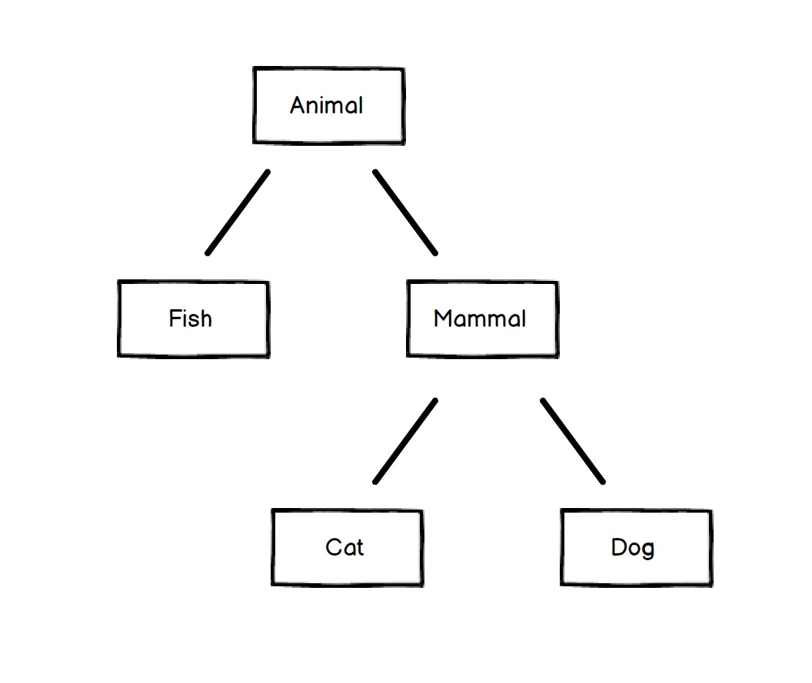

<h1 align="center"> The Object Model </h1>

- This first section will be an introduction to OOP in Ruby, particularly why we should use OOP and important concepts in OOP.
- [Source Link](https://launchschool.com/books/oo_ruby/read/the_object_model#whyobjectorientedprogramming)

# Object Oriented Programming
Object Oriented Programming (OOP) is a programming [paradigm](https://en.wikipedia.org/wiki/Paradigm) that was created to deal with the growing complexity of large software systems.
- As applications grew in complexity and size, they became very difficult to maintain. 
- In OOP, areas of code that performed certain procedures are section off so that their programs could become the **interaction of many small parts**, as opposed to one massive blob of dependency.
  - As such, one small change at any point in the program would not trigger a ripple effect of errors due to dependencies throughout the entire program. 

# Encapsulation
Encapsulation describes the idea of bundling or combining the **states (data) and behaviors (operations)** that work together on that data into a **single entity**, e.g. an object.

Encapsulation also entails hiding functionality to make it unavailable to the rest of the codebase.
- Data protection is the main goal here, only with obvious intent can that data be manipulated.
- In Ruby, like other OO languages, achieves this by **creating objects** and **exposing public interfaces** (i.e. methods) to interact with those objects.

# Example: A Simple Banking Application
- The code for the app, at a minimum, must contain **data** about the bank accounts (account number, balance, account type) and the users (name, address, phone number). 
- The code must also contain **behaviors or operations** that use and manipulate that data. For instance, we should have operations that open an account, make withdrawals, and deposit new funds.
- One thing is evident here: the **data and operations** that you perform on your data are **related**.
  - You don't want to apply an operation intended for a bank account on a user's data. For example, it doesn't make much sense to withdraw funds from a user. Instead, you want to withdraw funds from the account, so you want to operate on an account.


# Polymorphism
Polymorphism is the ability for **different types of data** to respond to a **common interface**. 
- For instance, if we have a **method** that invokes the **move method** on its **argument**, we can pass the method **any type of argument** as long as the argument has a **compatible** move method. The object might represent a human, a cat, a jellyfish, or, conceivably, even a car or train. That is, it lets objects of different types respond to the same method invocation.

**"Poly"** stands for **"many"** and **"morph"** stands for **"forms"**. OOP gives us flexibility in using **pre-written code for new purposes**.

# Inheritance
The concept of inheritance is used in Ruby where **a class inherits** -- that is, acquires -- the **behaviors of another class**, referred to as the **superclass**. 
- Define basic classes with **large reusability** and smaller subclasses for more **fine-grained, detailed** behaviors.

Another way to apply **polymorphic** structure to Ruby programs is to use a **Module**. 
- Modules are similar to classes in that they **contain shared behavior**. However, you **cannot create an object** with a module. 
- A module must be **mixed in with a class** using the **include method invocation**. This is called a **mixin**. 
  - After mixing in a module, the behaviors declared in that module are available to the **class and its objects**.
```ruby
module Study  
end

class MyClass  
  include Study  
end

my_obj = MyClass.new
```

# What are Objects?
In Ruby, everything is an object &rarr; Not exactly true!
- Anything that can be said to have a value **is** an object: that includes numbers, arrays, strings, and even classes and modules.
- However, **methods, blocks, and variables** stand out.

Note that **objects are created from classes.**
- Classes are molds and objects are the cast formed of the mold. 
- Two individual objects may contain different information from other objects, yet are instances of the same class.

Example:   
irb :001 > "hello".class  
=> String  
irb :002 > "world".class  
=> String  

# Classes Define Objects
Ruby defines the attributes and behaviors of its objects in classes. You can think of classes as **basic outlines** of what an object should be **made of** and what it should be able to **do**. 

To **define** a class, we use syntax similar to defining a method. 
- We replace the def with **class** and use the **CamelCase** naming convention to create the name.   
- We then use the reserved word **end** to finish the definition. 
- Ruby **file names** should be in **snake_case**, and reflect the class name. Thus, in the below example, the file name is **good_dog.rb** and the class name is **GoodDog**.
```ruby
class GoodDog  
end  

sparky = GoodDog.new
```
In the above example, we created an instance of our **GoodDog** class and stored it in the variable **sparky**. We now have an object. 

We say that sparky is an object or instance of class GoodDog. 

This entire workflow of **creating a new object or instance from a class** is called **instantiation**, so we can also say that we've instantiated an object called sparky from the class GoodDog. 

The terminology in OOP is something you'll eventually get used to, but the important fact here is that an **object** is **returned** by calling the **class method new**. Take a look at Figure 3 to visualize what we're doing.


As you can see, defining and creating a new instance of a basic class is simple. But before we go any further showing you how to create more elaborate classes, let's talk about modules briefly.

# Modules
Modules are another way to achieve polymorphism, describing a **collection** of behaviors that is usable in other classes via **mixins**.
- Use the **include** method invocation to mixin a module into a class.

Let's say we wanted our `GoodDog` class to have a speak method but we have other classes that we want to use a speak method with too. Here's how we'd do it.

```ruby
module Speak  
  def speak(sound)  
    puts sound  
  end  
end  

class GoodDog  
  include Speak  
end  

class HumanBeing  
  include Speak  
end  

sparky = GoodDog.new  
sparky.speak("Arf!")        # => Arf!  
bob = HumanBeing.new  
bob.speak("Hello!")         # => Hello!  
```
Note: 
- `sparky`, the GoodDog object, and `bob`, the HumanBeing object, both have access to the speak instance method. 
- "mixing in" the module Speak makes it as if we copy-pasted the speak method into the GoodDog and HumanBeing classes.

# Method Lookup
When you call a method, how does Ruby know where to look for that method? 
Ruby has a **distinct lookup path** that it follows each time a method is called. 

Let's use our program from above to see what the method lookup path is for our GoodDog class. We can use the ancestors method on any class to find out the method lookup chain.

```ruby
module Speak  
  def speak(sound)  
    puts "#{sound}"  
  end  
end  

class GoodDog  
  include Speak  
end  

class HumanBeing  
  include Speak  
end  

puts "---GoodDog ancestors---"  
puts GoodDog.ancestors  
puts ''  
puts "---HumanBeing ancestors---"  
puts HumanBeing.ancestors  

# The output looks like this:**  

---GoodDog ancestors---  
GoodDog  
Speak  
Object  
Kernel  
BasicObject  

---HumanBeing ancestors---  
HumanBeing  
Speak  
Object  
Kernel  
BasicObject  
``` 

The **Speak** module is placed right in **between our custom classes** (i.e., GoodDog and HumanBeing) and the **Object class** that comes with Ruby. 
- In **Inheritance** you'll see how the **method lookup chain works** when working with both **mixins** and **class inheritance**.

Since the **speak** method is not defined in the GoodDog class, the next place it looks is the **Speak** module. This continues in an **ordered, linear fashion,**  until the method is either **found**, or there are **no more places to look.**

<h1 align="center"> Classes and Objects - Part I </h1>

# States and Behaviors
As mentioned earlier, we use classes to create objects.

 When defining a class, we typically focus on two things: **state** and **behaviors**. 
 - **State** refers to the data associated to an individual object (which are tracked by instance variables). 
 - **Behaviors** are what objects are capable of doing.

For example, using our GoodDog class from earlier, we may want to create two GoodDog objects: one named "Fido" and one named "Sparky". 
- They are both GoodDog objects, but may contain different information, such as name, weight, and height. 
- We would use **instance variables** to track this information. 
- Instance variables are **scoped** at the **object (or instance) level**, and are how **objects** keep track of their **states**.

Even though they're two different objects, both are still **objects (or instances)** of class **GoodDog** and contain identical behaviors.
- Both GoodDog objects should be able to bark, run, fetch, and perform other common behaviors of good dogs &rarr; these behaviors are defined as **instance methods** in a class. 
- **Instance methods** defined in a class are available **to objects (or instances) of that class**.

In summary, **instance variables** keep track of **state**, and **instance methods** expose **behavior for objects**.

# Initializing a new Object: The `initialize` Constructor
Again, let's look at the `GoodDog` class from before, but let's start fresh and remove existing functionality from the previous chapter.

```ruby
# gooddog.rb
class GoodDog  
  def initialize  
    puts "This object was initialized!"  
  end  
end  

sparky = GoodDog.new        # => "This object was initialized!"
```
The `initialize` method gets called every time you create a new object. 
- We do indeed call the `new` method when we create an object, but calling the `new` **class method** eventually leads us to the `initialize` **instance method**.
- The difference between class methods and instance methods will be discussed later. 

In the above example, **instantiating a new** GoodDog object triggered the `initialize` method and resulted in the string being outputted. We refer to the `initialize` method as a **constructor**, because it is a special method that **builds the object** when a new object is **instantiated**. It gets triggered by the `new` class method.

In short:  
Instantiating an object using the `new` class method will trigger the `initialize` instance method, a **constructor** that **builds the object** when a new object is **instantiated**.

# Instance Variables
Now that we know how to use constructors in Ruby, let's create a **new object** and **instantiate it** with some state, like a name.

```ruby
# good_dog.rb
class GoodDog  
  def initialize(name)  
    @name = name  
  end  
end  
```
The **@name** variable is called an **instance variable**. 
- It exists as long as the object **instance exists** and it is one of the ways we tie data to objects. 
- It does not "die" after the initialize method is run. 
- It "lives on", to be referenced, until the object instance is destroyed. 

In the above example, our initialize method is defined with one parameter: **name**. You can pass arguments into the initialize method through the new method. Let's create an object using the GoodDog class from above:

`sparky = GoodDog.new("Sparky")`  

Here, the string **"Sparky"** is being passed from the new method through to the **initialize method**, and is assigned to the **local variable name**.
- Within the **constructor** (i.e., the initialize method), we then **set the instance variable @name to name**, which results in assigning the string "Sparky" to the @name instance variable.

The state for the object is tracked in the instance variable, @name. If we created another GoodDog object, for example, with fido = GoodDog.new('Fido'), then the @name instance variable for the fido object would contain the string "Fido". Every object's state is distinct, and instance variables are how we keep track.

# Composition and Aggregation
In OOP languages, composition and aggregation are design principles used to establish **relationships between classes**. 
- Both composition and aggregation involve using **instance variables** to hold **references to other objects**, but they differ in terms of the lifecycle and ownership of the objects involved.

# Composition - Container contains 1+ (composed) objects of other classes
Composition is a relationship where an object -- often called the **container** -- **contains** **one or more objects** of **other classes** as part of its state. 

In composition, the **contained -- composed --** objects are **tied directly to the container**.
 - The **lifetimes** of the **container and composed** objects are **dependent** on each other.
 - **Composed** objects are **created** when the **container is created** and **destroyed** when the **container is destroyed**.

In Ruby, composition is typically implemented using **instance variables** that are **initialized** via the **constructor** of the class. Here’s an example:

```ruby
class Engine  
  def start  
    puts "Engine starting..."  
  end  
end  

class Car  
  def `  
    @engine = Engine.new  # Engine instance is created when Car is created  
  end  

  def start  
    @engine.start  
  end  
end  

my_car = Car.new  
my_car.start  # Engine is an integral part of Car  
```

In this example, **Car has an Engine**, and **Car** instances **contain** an **Engine** object. 
- When the Car is instantiated, the Engine is also instantiated. 
- Likewise, when the Car object is destroyed, the composed Engine object is also destroyed.

We can say that a **container** has a **has-a** relationship to its **composed objects**. That is, the **container "has a" composed object**.

# Aggregation
Aggregation is a form of **association** that is **less tightly coupled than composition**. 
- Unlike composition, the **lifetime of the contained objects** does **not depend** on the **lifetime of the container**. 
- The **container** may have a **reference to the objects**, and it may** coordinate their operations**, but those objects typically exist **independently of the container**.

Here's an example:
```ruby
class Passenger  
end

class Car  
  def initialize(passengers) # This means passengers existed before the Car  
    @passengers = passengers # Passengers are given to the Car at creation  
  end  
end  

# Passengers can exist without Car  
passengers = [Passenger.new, Passenger.new]  
my_car = Car.new(passengers)
```
In this case, **Car instances have a list of Passenger objects**, but these Passenger objects can **exist independently** of the Car instance. 
They can be **passed to the Car object** when it's instantiated or any time before the Car instance is destroyed. However, the **Passenger objects will continue to live on** after the Car object is destroyed.

As with composed objects, we can say that a container has a **has-a relationship** to its aggregated objects. That is, the **container "has an" aggregated object.**

# Relation to Instance Variables
The relationships between a **container class instance** and its **composed and aggregated objects** is implemented with **instance variables**. 
- These **instance variables** hold **references to other objects**, enabling the container class to access and interact with the **contained objects' methods and propertie**s. 

The main difference lies in the **ownership and the lifecycle of the objects referenced** by these instance variables:
- `Composition`: The container **owns** the contained objects, and their **lifecycles are tightly linked**.
- `Aggregation`: The container **does not own** the contained objects; they can **exist independently.**

These concepts are fundamental in designing systems that are modular, where changes to one part of the system do not unduly affect others.

# Instance Methods
Right now, our GoodDog class can't really do anything. Let's give it some **behaviors**.

```ruby
# good_dog.rb  
class GoodDog  
  def initialize(name)  
    @name = name  
  end  

  def speak  
    "Arf!"  
  end  
end  

sparky = GoodDog.new("Sparky")  
sparky.speak  
```
When you run this program, nothing happens. This is because the speak method returned the string "Arf!", but we now **need to print it out.** So we should add puts in front of it, like this:

`puts sparky.speak           # => Arf!`  
Now, we should see that the output of our program is the string "Arf!". We told sparky to speak and he did. 

Now, suppose we have another GoodDog object:
```ruby
fido = GoodDog.new("Fido")  
puts fido.speak             # => Arf!  
```
Our second fido object can also perform **GoodDog behaviors**. Again, all objects of the same class have the same behaviors, though they contain different states; here, **the differing state is the name**.

What if we wanted to not just say "Arf!", but say "Sparky says arf!"? 
In our **instance methods**, which is what all the methods are so far, we have access to **instance variables**. 
- Use string interpolation and change our speak method to this (other code omitted):
```ruby
# good_dog.rb
def speak  
  "#{@name} says arf!"  
end  
```

And now, we can expose information about the state of the object using instance methods.
```ruby
puts sparky.speak           # => "Sparky says arf!"  
puts fido.speak            # => "Fido says arf!"  
```
# Accessor Methods
What if we wanted to print out only sparky's name? We could try the code below (other code omitted):

puts sparky.name  

Results in:  
`NoMethodError: undefined method `name' for` #<GoodDog:0x007f91821239d0 @name="Sparky">

A **NoMethodError** means that we **called a method** that doesn't exist or is unavailable to the object. 
- If we want to **access the object's name**, which is stored in the `@name` instance variable, we have to create a **method that will return the name**. 
- Say we call it `get_name`, and its only job is to **return** the value in the **@name instance variable**.

```ruby
# good_dog.rb
class GoodDog  
  def initialize(name)  
    @name = name  
  end  

  def get_name  
    @name  
  end  

  def speak  
    "#{@name} says arf!"  
  end  
end  

sparky = GoodDog.new("Sparky")  
puts sparky.speak  
puts sparky.get_name  
```
Ok, we've added our get_name method and it should return the value of our @name instance variable. Let's run this code and see if it works.

This is what we got back.

Sparky says arf!  
Sparky  
It worked! We now have a **getter method**. But what if we wanted to **change sparky's name?** That's when we reach for a **setter method**. It looks a lot like a getter method but with one small difference. Let's add it.
```ruby
# good_dog.rb
class GoodDog  
  def initialize(name)  
    @name = name  
  end  

  def get_name  
    @name  
  end  

  def set_name=(name)  
    @name = name  
  end  

  def speak  
    "#{@name} says arf!"  
  end  
end  

sparky = GoodDog.new("Sparky")  
puts sparky.speak  
puts sparky.get_name  
sparky.set_name = "Spartacus"  
puts sparky.get_name  
```

The output of this code is:

Sparky says arf!  
Sparky  
`Spartacus`

As you can see, we've successfully changed sparky's name to the string "Spartacus".
- The first thing you should notice about the setter method `set_name=` is that Ruby gives us a **special syntax** to use it. 
- To use the **set_name= method normally**, we would expect to do this: **sparky.set_name=("Spartacus")**, where the entire **"set_name=**" is the **method name**, and the string "**Spartacus**" is the **argument** being passed in to the method. 
- Ruby recognizes that this is a **setter method** and allows us to use the more natural assignment syntax: `sparky.set_name = "Spartacus"`. 
When you see this code, just realize there's a method called `set_name=` working behind the scenes, and we're just seeing some **Ruby syntactical sugar**.

Finally, as a **convention**, Rubyists typically want to name those getter and setter methods using the **same name as the instance variable** they are exposing and setting. We'll make the change to our code as well:
```ruby
# good_dog.rb
class GoodDog  
  def initialize(name)  
    @name = name  
  end  

  def name                  # This was renamed from "get_name"  
    @name  
  end  

  def name=(n)              # This was renamed from "set_name="  
    @name = n  
  end  

  def speak  
    "#{@name} says arf!"  
  end  
end  

sparky = GoodDog.new("Sparky")  
puts sparky.speak  
puts sparky.name            # => "Sparky"  
sparky.name = "Spartacus"  
puts sparky.name            # => "Spartacus"  
```

**Setter** methods always **return the value that is passed** in as an argument, **regardless** of **what happens inside** the **method**. 
- If the setter tries to return something other than the argument's value, it just **ignores** that attempt.
```ruby
class Dog  
  def name=(n)  
    @name = n  
    "Laddieboy"              # value will be ignored  
  end  
end

sparky = Dog.new()  
puts(sparky.name = "Sparky")  # returns "Sparky"  
```
You'll notice that writing those **getter and setter methods took up a lot of room** in our program for such a simple feature.
- Ruby has a **built-in way** to automatically create these getter and setter methods for us, using the attr_accessor method. Check out this refactoring of the code from above.

```ruby
# good_dog.rb
class GoodDog  
  attr_accessor :name  

  def initialize(name)  
    @name = name  
  end  

  def speak  
    "#{@name} says arf!"  
  end  
end

sparky = GoodDog.new("Sparky")  
puts sparky.speak  
puts sparky.name            # => "Sparky"  
sparky.name = "Spartacus"  
puts sparky.name            # => "Spartacus"  
```

Our output is the same! The `attr_accessor` method takes a **symbol** as an **argument**, which it uses to create the method name for the **getter and setter methods**. That one line replaced two method definitions.

But what if we **only** **want** the **getter** method **without the setter method**? Then we would want to use the `attr_reader` method. It works the same way but only allows you to retrieve the instance variable. 

And if you **only want** the **setter** method, you can use the `attr_writer` method. All of the attr_* methods take **Symbol objects** as arguments; if there are **more states** you're **tracking**, you can use this syntax:

`attr_accessor :name, :height, :weight`

# Accessor Methods in Action
With **getter and setter** methods, we have a way to **expose and change an object's state**. We can also use these methods from within the class as well. In the previous section, the speak method referenced the @name instance variable, like below:
```ruby
def speak  
  "#{@name} says arf!"  
end  
```
Instead of referencing the instance variable directly, we want to use the name getter method that we created earlier, and that is given to us now by `attr_accessor`. We'll change the speak method to this:
```ruby
def speak  
  "#{name} says arf!"  
end  
```
Can you spot the change? By **removing the @ symbol**, we're now calling the **instance method**, rather than the instance variable.

Why do this? Why not just reference the @name instance variable, like we did before? Technically, you could just reference the instance variable, but it's **generally a good idea** to call the **getter method** instead.

Suppose we're keeping track of social security numbers in an instance variable called @ssn. And suppose that we don't want to expose the raw data, i.e. the entire social security number, in our application. Whenever we retrieve it, we want to **only display the last 4 digits and mask the rest**, like this: "xxx-xx-1234". If we were **referencing the @ssn instance variable** directly, we'd need to sprinkle our entire class with code like this:
```ruby
# converts '123-45-6789' to 'xxx-xx-6789'  
'xxx-xx-' + @ssn.split('-').last  
```

And what if we find a **bug in this code**, or if someone says we **need to change the format** to something else?
- Much easier to just reference a getter method, and make the change in one place.
```ruby
def ssn  
  # converts '123-45-6789' to 'xxx-xx-6789'  
  'xxx-xx-' + @ssn.split('-').last  
end  
```

Now we can use the ssn instance method (note without the @) throughout our class to retrieve the social security number. Following this practice will save you some headache down the line. Just like the getter method, we also want to do the same with the setter method. 
- Wherever we're changing the **instance variable directly** in our class, we should instead use the **setter method**. But there's a **gotcha**, which we'll cover next.


Suppose we added two more states to track to the GoodDog class called **"height"** and **"weight"**:

`attr_accessor :name, :height, :weight`

- This one line of code gives us **six getter/setter instance methods: name, name=, height, height=, weight, weight=**. 
- It also gives us **three instance variables**: **@name, @height, @weight**. 

Now suppose we want to create a new **method** that allows us to change **several states at once**, called `change_info(n, h, w)`.

 We could implement it like this:
```ruby
def change_info(n, h, w)  
  @name = n  
  @height = h  
  @weight = w  
end  
```

Just to get caught up with all of our code, our **entire GoodDog class** now looks like the code below. 
- Note the change to the **initialize** method and also the new method `change_info`. 

Finally, we created another method called **info** that displays **all the states of the object**, just for convenience:

```ruby
# good_dog.rb  
class GoodDog  
  attr_accessor :name, :height, :weight  

  def initialize(n, h, w)  
    @name = n  
    @height = h  
    @weight = w  
  end  
  
  def speak  
    "#{name} says arf!"  
  end  
  
  def change_info(n, h, w)  
    @name = n  
    @height = h  
    @weight = w  
  end  
  
  def info  
    "#{name} weighs #{weight} and is #{height} tall."  
  end  
end  
```

And we can use the `change_info` method like this:  
```ruby
sparky = GoodDog.new('Sparky', '12 inches', '10 lbs')  
puts sparky.info      # => Sparky weighs 10 lbs and is 12 inches tall.  

sparky.change_info('Spartacus', '24 inches', '45 lbs')  
puts sparky.info      # => Spartacus weighs 45 lbs and is 24 inches tall.  
```

Just like when we **replaced** **accessing** the **instance variable directly with getter methods**, we'd also like to do the **same with our setter methods**. Let's change the implementation of the change_info method to this:
```ruby
def change_info(n, h, w)  
  name = n  
  height = h  
  weight = w  
end  
```

To save space, we won't repeat the code from above, but we can see that the **change_info** method **didn't change sparky's information**:
```ruby
sparky.change_info('Spartacus', '24 inches', '45 lbs')  
puts sparky.info      # => Sparky weighs 10 lbs and is 12 inches tall.  
```
What happened? Why didn't our setter methods work in the change_info method?

# Calling Methods With self
The reason our setter methods didn't work is because **Ruby thought** we were **initializing local variables**. 
- Recall: to **initialize or create new local variables** &rarr; x = 1 or str = "hello world".
- Instead of calling the **name=, height= and weight= setter methods,** we ended up **creating three new local variables** called name, height and weight. 

**To disambiguate** from creating a local variable, we need to use `self.name=` to let Ruby know that we're **calling a method**. So our change_info code should be updated to this:
```ruby
def change_info(n, h, w)  
  self.name = n  
  self.height = h  
  self.weight = w  
end  
```
This **tells Ruby** that we're calling a **setter method**, not creating a local variable. To be consistent, we **could also adopt this syntax** for the getter methods as well, though it is **not required.**
```ruby
def info  
  "#{self.name} weighs #{self.weight} and is #{self.height} tall."  
end  
```
Finally, if we run our code with the updated change_info method that uses the self. syntax, our code works beautifully:
```ruby
sparky.change_info('Spartacus', '24 inches', '45 lbs')  
puts sparky.info      # => Spartacus weighs 45 lbs and is 24 inches tall.  
```
Note that prefixing `self.` is not restricted to just the accessor methods; you **can use it with any instance method**.
- For example, the **info method** is not a method given to us by attr_accessor, but we can still call it using **self.info:**
```ruby
class GoodDog  
  # ... rest of code omitted for brevity  
  def some_method  
    self.info  
  end  
end  
```
While this works, the general rule from the Ruby style guide is to 
- `"Avoid self where not required."`

# Exercises 
- See `..\scripts\02-object-oriented-ruby\classes_and_objects.rb` 

<h1 align="center">  Classes and Objects II </h1>

# Class Methods
All the methods we've created have been instance methods: methods that pertain to an **instance or object** of the class. 

**Level methods**, also called **class methods**, are methods we can call **directly on the class** itself, **without having to instantiate** any objects. 

When defining a **class method**, we **prepend** the method name with the reserved word `self.`, 
like this:
```ruby
# ... rest of code ommitted for brevity

def self.what_am_i         # Class method definition  
  "I'm a GoodDog class!  
end  
```
When calling the class method what_am_i:  
`GoodDog.what_am_i`          # => I'm a GoodDog class!

Class methods are where we put functionality that does not pertain to individual objects.
- Particularly, if a method does not need to deal with an object's states, a class method is more appropriate.

# Class Variables
As instance variables capture information specific to instances of a class, variables for an entire class are appropriately named **class variables**.
- Class variables are created using two @ symbols: `@@class_var_name`

Let's create a **class variable** and a **class method** to view that variable.
```ruby
class GoodDog  
  @@number_of_dogs = 0  

  def initialize  
    @@number_of_dogs += 1  
  end  

  def self.total_number_of_dogs  
    @@number_of_dogs  
  end  
end  

puts GoodDog.total_number_of_dogs   # => 0  

dog1 = GoodDog.new  
dog2 = GoodDog.new  

puts GoodDog.total_number_of_dogs   # => 2  
```

The **class variable** `@@number_of_dogs` is initialized to 0.
- Our constructor (the initialize method called when an object is instantiated with the new keyword), increments that number by 1. 
- This also demonstrates that we can **access class variables** from **within** an **instance method** (initialize is an instance method). 
- Finally, we just return the value of the class variable in the class method `self.total_number_of_dogs`.

 This example uses a **class variable** and a **class method** to keep track of a **class level detail** that pertains only to the **class, and not to individual objects.**

# Constants 
Pretty simple: variables that you never want to change remain constant, and are named as such.
- Infitting with the naming conventions of a constant, a constant in Ruby is defined by using an **upper case letter** at the beginning of the variable name.
- Most Rubyists will tend to capitalize the entire word as is convention anyways.
```ruby
class GoodDog  
  DOG_YEARS = 7  
  
  attr_accessor :name, :age  
  
  def initialize(n, a)  
    self.name = n  
    self.age  = a * DOG_YEARS  
  end  
end  
  
sparky = GoodDog.new("Sparky", 4)  
puts sparky.age             # => 28  
```
Here we used the constant `DOG_YEARS` to calculate the age in dog years when we created the object, sparky. 
- Note that we used the setter methods in the initialize method to initialize the **@name and @age instance variables** given to us by the **attr_accessor** method.
- We then used the age getter method to retrieve the value from the object.  


`DOG_YEARS` is a variable that will **never change for any reason** so we use a constant. 
- It is **possible to reassign a new value** to constants but **Ruby will throw a warning**.
# The to_s Method
The `to_s` instance method comes built into every class in Ruby. 

`puts sparky      # => #<GoodDog:0x007fe542323320>`

What's happening here is that the puts method **automatically** calls `to_s` on its argument, which in this case is the **sparky object**. 
- puts sparky is equivalent to `puts sparky.to_s`. 
- By default, the to_s method returns the **name of the object's class** and an **encoding** of the **object id**.

Note: puts method calls `to_s` for any argument that is **not an array**.
- For an array, it writes on **separate lines** the result of calling `to_s` on **each element** of the array.

To test this, we can add a **custom** `to_s` method to our GoodDog class, **overriding** the default **to_s** that comes with Ruby.
```ruby
class GoodDog  
  DOG_YEARS = 7  
  
  attr_accessor :name, :age  
  
  def initialize(n, a)  
    @name = n  
    @age  = a * DOG_YEARS  
  end  
  
  def to_s  
    "This dog's name is #{name} and it is #{age} in dog years."  
  end  
end  

puts sparky      # => This dog's name is Sparky and is 28 in dog years.
```
There's another method called `p` that's very similar to puts, except it **doesn't call to_s** on its argument; it calls another built-in Ruby instance method called `inspect`. 
- The `inspect` method is very helpful for debugging purposes, so we don't want to override it.

`p sparky          => #<GoodDog:0x007fe54229b358 @name="Sparky", @age=28>`

This output implies that `p sparky` is equivalent to `puts sparky.inspect`.

`to_s` method is automatically on the `arr` array object, as well as the `x` integer object.

Besides being called automatically when using `puts`, another important attribute of the to_s method is that it's also **automatically** called in **string interpolation**. We've seen this before when using integers or arrays in string interpolation:
```
irb :001 > arr = [1, 2, 3]  
=> [1, 2, 3]  
irb :002 > x = 5  
=> 5  
irb :003 > "The `#{arr}` array doesn't include `#{x}`."  
=> The [1, 2, 3] array doesn't include 5.  
```
Here, the `to_s` method is **automatically** called on the arr array object, as well as the x integer object. We'll see if we can include our sparky object in a string interpolation:

irb :001 > "`#{sparky}`"  
=> "This dog's name is Sparky and it is 28 in dog years."  

In summary, the `to_s` method is called **automatically** on the object when we use it with **puts** or when used with **string interpolation**. This fact may seem trivial at the moment, but knowing when `to_s` is called will help us understand how to read and write better OO code.

# Overriding #to_s
As shown above, you can **customize** the behavior of `#to_s` in a class. If you don't customize `#to_s`, Ruby looks up the **inheritance chain** for another version of `#to_s`, which is usually `Object#to_s`.

When **overriding** (customizing) #to_s for use in a custom class, you must remember that Ruby expects **#to_s to always return a string**. 
- If it does not return a string, **#to_s won't work** as expected in places where #to_s is **implicitly invoked** like **puts and interpolation**. 
  - Instead of printing (or inserting) the value returned by #to_s, Ruby will **ignore the non-string value** and look in the inheritance chain for another version of **#to_s** that does **return a string**. 
  - In most cases, it will use the value returned by **Object#to_s** instead. 
  
  For instance:
```ruby
class Foo  
  def to_s  
    42  
  end  
end  
  
foo = Foo.new  
puts foo             # Prints #<Foo:0x0000000100760ec0>  
puts "foo is #{foo}" # Prints: foo is #<Foo:0x0000000100760ec0>  
```
If you change 42 to a string, then the code will work as intended:  
```ruby
class Foo  
  def to_s  
    "42"  
  end  
end  
  
foo = Foo.new  
puts foo             # Prints 42  
puts "foo is #{foo}" # Prints: foo is 42  
```
It's also worth noting that **overridding #to_s** only works for **objects** of the **type** where the customized **#to_s method is defined**. 
- In particular, if you have a **Bar** object named **bar** that has an **attribute** named **xyz** and a **Bar#to_s** method, then puts bar.xyz will not use the customized #to_s. The value returned by xyz is not a Bar object, so Bar#to_s does not apply it:
```ruby
class Bar  
  attr_reader :xyz  
  def initialize  
    @xyz = { a: 1, b: 2 }  
  end  
  
  def to_s  
    'I am a Bar object!'  
  end  
end  
  
bar = Bar.new  
puts bar       # Prints I am a Bar object!  
puts bar.xyz   # Prints {:a=>1, :b=>2}  
```
# More about `self`
`self` can refer to different things depending on where it is used.

For example, so far we've seen two clear use cases for self:

Use `self` when calling **setter methods** from **within the class**. 
- In our earlier example we showed that `self` was necessary in order for our change_info method to work properly. 
- We had to use `self` to allow Ruby to **disambiguate** between initializing a local variable and calling a setter method.

Use self for **class method** definitions.

Let's play around with self to see why the above two rules work. Let's assume the following code:
```ruby
class GoodDog  
  attr_accessor :name, :height, :weight  

  def initialize(n, h, w)  
    self.name   = n  # This is calling the setter for name provided by attr_accessor  
    self.height = h  
    self.weight = w  
  end  

  def change_info(n, h, w)  
    self.name   = n  
    self.height = h  
    self.weight = w  
  end  

  def info  
    "#{self.name} weighs #{self.weight} and is #{self.height} tall."  
  end  
end  
```
This is our standard GoodDog class, and we're using `self` whenever we call an **instance method** from within the class. We know the rule to use self, but what does self really represent here? Let's add one more instance method to help us find out.  
```ruby
class GoodDog  
   # ... rest of code omitted for brevity  

  def what_is_self  
    self  
  end  
end  

# Now we can instantiate a new GoodDog object.  

sparky = GoodDog.new('Sparky', '12 inches', '10 lbs')  
p sparky.what_is_self  
# => #<GoodDog:0x007f83ac062b38 @name="Sparky", @height="12 inches", @weight="10 lbs">  
```
That's interesting. From **within the class**, when an **instance method** uses `self`, it **references** the **calling object**. 
- In this case, that's the sparky object. Therefore, from within the change_info method, calling **self.name=** acts the **same** as calling **sparky.name=** from **outside the class** (you can't call sparky.name= inside the class, though, since it isn't in scope). 
- Now we understand why using self to call instance methods from within the class works the way it does!  

The other place we use self is when we're defining **class methods**, like this:  
```ruby
class MyAwesomeClass  
  def self.this_is_a_class_method  
  end  
end  
```

When `self` is **prepended to a method definition**, it is defining a **class method**. We talked about these earlier. 
- In our GoodDog class method example, we defined a class method called self.total_number_of_dogs. This method returned the value of the class variable @@number_of_dogs. How is this possible? Let's add a line to our GoodDog class:  
```ruby
class GoodDog  
  # ... rest of code omitted for brevity  
  puts self  
end 
``` 

If you run the good_dog.rb file with the GoodDog class definition, you'll see that **GoodDog** is **output**. 
- Thus, you can see that using `self` **inside a class** but **outside an instance method** refers to the **class itself.** 
- Therefore, a **method** definition **prefixed with self** is the same as **defining the method on the class**. That is, def `self.a_method` is **equivalent** to def `GoodDog.a_method`. 
- That's why it's a class method; it's **actually being defined on the class**. 
- Using `self.a_method`, rather than ClassName.a_method is a **convention**. 
  - If in the future we **rename the class**, we only have to change the **name of the class**, rather than having to rename all of the class methods too.  

To be clear, from within a class...  

1. `self`, **inside** of an **instance method**, references the **instance (object)** that **called the method** - the calling **object**. 
- Therefore, **self.weight=** is the same as **sparky.weight=**, in our example.  

1. `self`, **outside** of an **instance method**, references the **class** and can be used to define **class methods**. 
- Therefore if we were to define a name class method, def **self.name=(n)** is the same as def **GoodDog.name=(n)**.  

Thus, we can see that `self` is a way of being **explicit** about what our **program is referencing** and what our intentions are as far as behavior. 
`self` changes depending on the **scope** it is used in, so pay attention to see if you're **inside an instance method** or not.

# Summary 
In this chapter we covered...

- Initializing objects with the `new` method
- How `instance variables` keep track of an **object's state**
- Learning how `attr_*` methods generate **getters and setters**
- Using `instance methods` to perform operations on our objects
- Using `class methods` to perform operations at the **class level**
- Assigning `class variables` to relate specifically to our class
- Assigning `constants` that never change to perform operations in our classes
- How the `to_s` method is used and that we've been using it **implicitly** all along.
- How and when to use `self`

# Exercises 
- See `..\scripts\02-object-oriented-ruby\classes_and_objects.rb` 

<h1 align="center">  Inheritance </h1>

`Inheritance` is when a **(sub)class** inherits behaviors from a **(super)class**.
- Common, shared behaviors between classes &rarr; move it to **superclass**!

# Class Inheritance
Here, we're extracting the speak method from the **GoodDog** class to the `superclass` **Animal**, and we use **inheritance** to make that behavior available to **GoodDog** and **Cat** classes.
```ruby
class Animal  
  def speak  
    "Hello!"  
  end  
end  

class GoodDog < Animal  
end  

class Cat < Animal  
end  

sparky = GoodDog.new  
paws = Cat.new  
puts sparky.speak           # => Hello!  
puts paws.speak             # => Hello!  
```
We use the `< symbol` to signify that the **GoodDog** class is inheriting from the **Animal** class. 
- **All** of the **methods** in the **Animal** class are available to the **GoodDog** class for use. 
- The new class called **Cat** that inherits from **Animal** as well. We've eliminated the speak method from the GoodDog class in order to use the speak method from Animal.  
- When we run this code we see the correct output. Both classes are now using the superclass Animal's speak method.  

But what if we want to use the original speak method from the GoodDog class only. Let's add it back and see what happens.  
```ruby
class Animal  
  def speak  
    "Hello!"  
  end  
end  

class GoodDog < Animal  
  attr_accessor :name  

  def initialize(n)  
    self.name = n  
  end  

  def speak  
    "#{self.name} says arf!"  
  end  
end  

class Cat < Animal  
end  

sparky = GoodDog.new("Sparky")  
paws = Cat.new  

puts sparky.speak           # => **Sparky says arf!**  
puts paws.speak             # => Hello!  
```
In the **GoodDog** class, we're `overriding` the **speak** method in the Animal class because Ruby **checks the object's class first** for the method before it looks in the superclass. 
- That means when we wrote the code `sparky.speak`, it first looked at **sparky's class**, which is **GoodDog**. It found the speak method there and used it.
- When we wrote the code `paws.speak`, Ruby first looked at **paws's class**, which is **Cat**. It did not find a speak method there, so it continued to look in Cat's **superclass**, Animal. It found a speak method in Animal, and used it. 

`Inheritance` can be a great way to **remove duplication** in your code base. 
- "**DRY**": "Don't Repeat Yourself" &rarr; If you find yourself writing the same logic over and over again in your programs, there are ways to extract that logic to one place for reuse.

# super

Ruby provides us with the `super` keyword to call methods **earlier** in the **method lookup path**. 
- When you call `super` from **within a method**, it searches the **method lookup path** for a method with the **same name**, then invokes it. 

Let's see a quick example of how this works:

```ruby
class Animal  
  def speak  
    "Hello!"  
  end  
end  

class GoodDog < Animal  
  def speak  
    super + " from GoodDog class"  
  end  
end  

sparky = GoodDog.new  
sparky.speak        # => "Hello! from GoodDog class"  
```
In the above example, 
- We've created a simple **Animal** class with a **speak** instance method. 
- We then created **GoodDog** which **subclasses Animal** also with a **speak** instance method to **override the inherited version**. 
- However, in the **subclass' speak** method we use `super` to invoke the **speak** method from the **superclass, Animal**, and then we extend the functionality by appending some text to the return value.  

Another more common way of using super is with `initialize`. Let's see an illustration of that:  

```ruby
class Animal  
  attr_accessor :name  

  def initialize(name)  
    @name = name  
  end  
end  

class GoodDog < Animal  
  def initialize(color)  
    super  
    @color = color  
  end  
end  

bruno = GoodDog.new("brown")        # => `#<GoodDog:0x007fb40b1e6718 @color="brown", @name="brown">`  
```

The interesting concept we want to explain is the use of `super` in the **GoodDog class**.
- In this example, we're using `super` with **no arguments**. However, the `initialize` method, where `super` is being used, takes an argument and adds a new twist to how super is invoked. 
- Here, in addition to the default behavior, `super` **automatically forwards the arguments** that were passed to the method from which `super` is called (initialize method in GoodDog class). 
- At this point, `super` will **pass** the **color** argument in the initialize defined in the subclass to that of the **Animal superclass** and **invoke** it. 
- That explains the presence of **@name="brown"** when the bruno instance is created. 
- Finally, the subclass' `initialize` continues to **set the @color** instance variable.  

When called with **specific arguments**, eg. super(a, b), the **specified arguments** will be sent up the **method lookup chain**. Let's see a quick example:  

```ruby
class BadDog < Animal  
  def initialize(age, name)  
    super(name)  
    @age = age  
  end  
end  

BadDog.new(2, "bear")        # => `#<BadDog:0x007fb40b2beb68 @age=2, @name="bear">`  
```
This is similar to our previous example, with the difference being that `super` takes an argument, hence the **passed in argument is sent** to the superclass. 
- Consequently, in this example when a BadDog object is created, the passed in name argument ("bear") is passed to the superclass and **set to the @name** instance variable.  

There's one last twist. If you call `super()` exactly as shown -- `with parentheses` -- it calls the **method in the superclass with no arguments** at all. 
- If you have a **method** in your **superclass** that takes **no arguments**, this is the **safest** -- and **sometimes the only** -- way to call it:  

```ruby
class Animal  
  def initialize  
  end  
end  

class Bear < Animal  
  def initialize(color)  
    super()  
    @color = color  
  end  
end  

bear = Bear.new("black")        # => #<Bear:0x007fb40b1e6718 @color="black">
```  
If you forget to use the parentheses here, Ruby will raise an `ArgumentError` exception since the **number of arguments is incorrect**.  

# Mixing in Modules

Another way to **DRY** up your code in Ruby is to use **modules**. 

**Extracting common methods to a superclass,** like we did in the previous section, is a great way to model concepts that are **naturally hierarchical**.
- We gave the example of animals. We have a generic superclass called Animal that can keep all basic behavior of all animals. We can then expand on the model a little and have, perhaps, a Mammal subclass of Animal. We can imagine the entire class hierarchy to look something like the figure below.





The above diagram shows what pure **class based inheritance** looks like. 
- Remember the goal of this is to put the right behavior (i.e., methods) in the right class so we don't need to repeat code in multiple classes. 
- We can imagine that all Fish objects are related to animals that live in the water, so perhaps a `swim` method should be in the Fish class. 
- We can also imagine that all **Mammal** objects will have **warm blood**, so we can create a method called `warm_blooded?` in the **Mammal** class and have it return **true**. 
- Therefore, the Cat and Dog objects will have access to the `warm_blooded?` method which is automatically inherited from Mammal by the Cat and Dog classes, but they won't have access to the methods in the Fish class.

This type of hierarchical modeling works, to some extent, but **there are always exceptions**. For example, we put the swim method in the Fish class, but some mammals can swim as well. We don't want to move the swim method into Animal because not all animals swim, and we don't want to create another swim method in Dog because that violates the DRY principle. For concerns such as these, we'd like to **group them into a module** and then **mix in that module to the classes** that require those behaviors. Here's an example:

```ruby
module Swimmable  
  def swim  
    "I'm swimming!"  
  end  
end  

class Animal; end  

class Fish < Animal  
  include Swimmable         # mixing in Swimmable module  
end  

class Mammal < Animal  
end  

class Cat < Mammal  
end  

class Dog < Mammal  
  include Swimmable         # mixing in Swimmable module  
end  
```
And now **Fish and Dog objects can swim**, but objects of other classes won't be able to:  
```ruby
sparky = Dog.new  
neemo  = Fish.new  
paws   = Cat.new  
sparky.swim                 # => I'm swimming!  
neemo.swim                  # => I'm swimming!  
paws.swim                   # => NoMethodError: undefined method `swim' for #<Cat:0x007fc453152308>  
```

Using **modules to group common behaviors** allows us to build a more **powerful, flexible** and DRY design.  

Note: A common naming convention for Ruby is to use the `"able" suffix` on whatever verb describes the **behavior that the module is modeling**.
- You can see this convention with our `Swimmable` module. 
- Likewise, we could name a module that describes "walking" as `Walkable`. Not all modules are named in this manner, however, it is quite common.

# Inheritance vs Modules

Now you know the two primary ways that Ruby implements inheritance. 
- `Class inheritance` is the traditional way to think about inheritance: **one type inherits the behaviors of another type**. The result is a **new type** that **specializes** the type of the **superclass**.
- The other form is sometimes called `interface inheritance`: this is where **mixin modules** come into play. The **class doesn't inherit** from another type, but instead **inherits the interface** provided by the **mixin module**. In this case, the **result type is not a specialized** type with respect to the module.

You may wonder when to use **class inheritance vs mixins**. Here are a couple of things to consider when evaluating these choices.

You can only **subclass** (class inheritance) from `one` **class**. You can **mix in** as `many modules` (interface inheritance) as you'd like.

`Class Inheritance`: If an instance of **class B** can be described as **a kind of class A**, then we say that B and A have an **is-a** relationship. 
- If such a relationship exists, then we probably want to use **class inheritance** such that **class B inherits from class A**.

`Interface Inheritance`: If **class B and A** do **not** have an **is-a** relationship, there may be a **has-a relationship** involved. 
- We saw **has-a** relationships in conjunction with **composition and aggregation**, but such relationships also exist when **interface existence** is desired.
- If you can say that **class A** has the **behaviors of type B**, but **B and A don't have an is-a** relationship, then you probably want to **define B as a module** and use **interface inheritance**.

Note that you `cannot instantiate modules`. In other words, **objects cannot be created from modules.**
As you get better at OO design, you'll start to develop a feel for when to use class inheritance versus mixing in modules.
# Method Lookup Path

Now that you have a grasp on both **inheritance and mixins**, let's put them both together to see how that affects the `method lookup path`. 
- Recall the `method lookup path` is the **order** in which **classes are inspected** when you **call a method**. Let's take a look at the example code below.
```ruby
module Walkable  
  def walk  
    "I'm walking."  
  end  
end  

module Swimmable  
  def swim  
    "I'm swimming."  
  end  
end  

module Climbable  
  def climb  
    "I'm climbing."  
  end  
end  

class Animal  
  include Walkable  

  def speak  
    "I'm an animal, and I speak!"  
  end  
end  
```
We have three modules and one class. We've mixed in one module into the Animal class. The method lookup path is the path Ruby takes to look for a method. We can see this path with the ancestors class method.  

```ruby
puts "---Animal method lookup---"  
puts Animal.ancestors  
```
The output looks like this:  

```ruby
---Animal method lookup---  
Animal  
Walkable  
Object  
Kernel  
BasicObject  
```
This means that when we call a **method of any Animal object**
- First Ruby looks in the **Animal class**
- then the **Walkable module**
- then the **Object class**
- then the **Kernel module**
- and finally the **BasicObject class**.  

```ruby
fido = Animal.new  
fido.speak                  # => I'm an animal, and I speak!  
```
Ruby found the speak method in the **Animal class** and looked no further.  

```ruby
fido.walk                   # => I'm walking.  
```
Ruby first **looked for the walk instance method in Animal**, and not finding it there, kept looking in the next place according to our list, which is the **Walkable module**. It saw a walk method there, executed it, and stopped looking further.  

```ruby
fido.swim  
  # => NoMethodError: undefined method `swim' for #\<Animal:0x007f92832625b0>  
```
Ruby traversed all the classes and modules in the list, and didn't find a swim method, so it threw an error.  

Let's add another class to the code above. This class will inherit from the Animal class and mix in the Swimmable and Climbable modules.  

```ruby
class GoodDog < Animal  
  include Swimmable  
  include Climbable  
end  

puts "---GoodDog method lookup---"  
puts GoodDog.ancestors  
```
And this is the output we get:  

```ruby
---GoodDog method lookup---  
GoodDog  
Climbable  
Swimmable  
Animal  
Walkable  
Object  
Kernel  
BasicObject  
```

There are several interesting things about the above output. 
- First, this tells us that the **order in which we include modules is important**. Ruby actually looks at the `last module we included first`. 
- This means that in the rare occurrence that the modules we mix in contain a method with the same name, the **last module included will be consulted first**. 
- The second interesting thing is that the **module included in the superclass** made it on to the **method lookup path**. That means that all **GoodDog** objects will have access to **not** **only Animal methods**, but also methods defined in the **Walkable module**, as well as **all other modules mixed** in to any of its **superclasses**.

Sometimes when you're working on a large project, it can be confusing where all these methods are coming from. By understanding the method lookup path, we can have a better idea of where and how all available methods are organized.

# More Modules

We've already seen how modules can be used to mix-in common behavior into classes. Now we'll see two more uses for modules.  

The first use case we'll discuss is using **modules for** `namespacing`. 
- In this context, namespacing means **organizing similar classes** under a **module**. In other words, we'll use modules to **group related classes**. Therein lies the first advantage of using modules for namespacing. It becomes **easy** for us to **recognize related classes** in our code. The second advantage is it **reduces the likelihood** of our **classes colliding** with other **similarly named classes** in our codebase. Here's how we do it:  

```ruby  
module Mammal  

  class Dog  
    def speak(sound)  
      p "#{sound}"  
    end  
  end  

  class Cat  
    def say_name(name)  
      p "#{name}"  
    end  
  end  
end  
```
We call **classes in a module** by appending the class name to the module name with two colons(::)  

```ruby  
buddy = Mammal::Dog.new  
kitty = Mammal::Cat.new  

buddy.speak('Arf!')           # => "Arf!"  
kitty.say_name('kitty')       # => "kitty"  
```

The second use case for modules we'll look at is using **modules as a container for methods**, called `module methods`. This involves using modules to house other methods. This is very useful for methods that seem out of place within your code. Let's use a new module to demonstrate this:  

```ruby
module Conversions  
  def self.farenheit_to_celsius(num)  
    (num - 32) * 5 / 9  
  end  
end  
```

Defining methods this way within a module means we can **call them directly from the module**:  

```ruby  
value = Conversions.farenheit_to_celsius(32)  
```
We can also call such methods by doing:  
```ruby
value = Conversions::farenheit_to_celsius(32)
```

although the former (`Conversions.`) is the **preferred** way.  

# Private, Protected, and Public  

The last thing we want to cover is something that's actually quite simple, but necessary; `Method Access Control`.
- It is generally implemented through the use of **access modifiers**. The purpose of access modifiers is to **allow or restrict access** to a particular thing. 
- In Ruby, the things that we are concerned with **restricting access** to are the **methods defined in a class**. In a Ruby context, therefore, you'll commonly see this concept referred to as Method Access Control.  

The way that Method Access Control is implemented in Ruby is through the use of the `public`, `private`, and `protected` **access modifiers**. Right now, all the methods in our GoodDog class are public methods. 

A `public` **method** is a method that is **available to anyone** who knows either the **class name** or the **object's name**.
- These methods are **readily available** for the **rest of the program to use** and comprise the class's interface (that's how other classes and objects will interact with this class and its objects).  

Sometimes you'll have **methods** that are doing work **in the class** but **don't need** to be available to the **rest of the program**. These methods can be defined as `private`. How do we define private methods? 
- We use the private method call in our program and **anything below it is private** (unless another method, like protected, is called after it to negate it).  

In our GoodDog class we have one operation that takes place that we could move into a private method. When we initialize an object, we calculate the dog's age in Dog years. Let's refactor this logic into a method and make it private so nothing outside of the class can use it.  

```ruby
class GoodDog  
  DOG_YEARS = 7  

  attr_accessor :name, :age  

  def initialize(n, a)  
    self.name = n  
    self.age = a  
  end  

  private # anything below this is private unless a protected keyword is called  

  def human_years  
    age * DOG_YEARS  
  end  
end  

sparky = GoodDog.new("Sparky", 4)  
sparky.human_years  
```
We get the error message:  

```ruby
NoMethodError: private method 'human_years' called for 
# => #<GoodDog:0x007f8f431441f8 @name="Sparky", @age=4>
```
  
We have made the human_years method `private` by placing it under the private method. What is it good for, then, if we can't call it? **private methods** are only **accessible** from **other methods in the class**. For example, given the above code, the following would be allowed:  

  
 assume the method definition below is above the "private" method  
```ruby
def public_disclosure  
  "#{self.name} in human years is #{human_years}"  
end  
```

Note that in this case (and prior to `Ruby 2.7`), we **can not** use **self.human_years**, because the **human_years** method is `private`. Remember that **self.human_years** is equivalent to **sparky.human_years**, which is **not allowed for private methods**. Therefore, we have to just use human_years. 
- In summary, `private` methods are **not accessible** outside of the **class definition** at all, and are **only accessible** from **inside the class** when **called** **without self**.  

Again, as of `Ruby 2.7`, it is now **legal** to call **private methods** with a **literal self** as the **caller**. 
- Note that this does not mean that we can call a private method with any other object, not even one of the same type. We can only **call a private method** with the **current object**.  

`public` and `private` methods are most common, but in some less common situations, we'll want an **in-between approach**. For this, we can use the `protected` method to create protected methods. `protected` methods are similar to private methods in that they **cannot be invoked outside the class**. The main difference between them is that `protected` methods **allow access between class instances**, while private methods do not.  

Let's take a look at an example:  

```ruby 
class Person  
  def initialize(age)  
    @age = age  
  end  

  def older?(other_person)  
    age > other_person.age #   this implies each **Person** can access another **Person**'s age getter method  
  end  

  protected  

  attr_reader :age  
end  

malory = Person.new(64)  
sterling = Person.new(42)  

malory.older?(sterling)  # => true  
sterling.older?(malory)  # => false  

malory.age  # getter from `attr_reader`  
  # => NoMethodError: protected method `age' called for #<Person: @age=64>  
```
The above code shows us that
- Like `private` methods, `protected` methods **cannot be invoked** from **outside of the class**. &rarr; malory.age **fails**
- However, **unlike** `private` methods, **other instances** of the **class (or subclass)** can also **invoke the method**. This allows for **controlled access**, but **wider access** between objects of the **same class type**.  

# Accidental Method Overriding  

It’s important to remember that **every class** you create **inherently subclasses** from class `Object`. The Object class is **built into Ruby** and comes with **many critical methods**.  

```ruby
class Parent  
  def say_hi  
    p "Hi from Parent."  
  end  
end  

Parent.superclass       # => Object
```  
This means that methods defined in the Object class are available in all classes.  

Further, recall that through the magic of inheritance, a subclass can **override a superclass’s method**.  

```ruby
class Child < Parent  
  def say_hi  
    p "Hi from Child."  
  end  
end  

child = Child.new  
child.say_hi         # => **"Hi from Child."**  
```
This means that, if you **accidentally override a method** that was originally defined in the **Object class**, it can have far-reaching effects on your code. 
- For example, `send` is an **instance method** that all classes inherit from **Object**. If you defined a new `send` instance method in your class, all objects of your class will call your custom `send` method, instead of the one in class Object, which is probably the one they mean to call. 
- **Object** `send` serves as a way to **call a method** by **passing** it a **symbol or a string** which represents the **method you want to call**. The next couple of arguments will represent the method's arguments, if any. Let's see how `send` normally works by making use of our Child class:  

```ruby
son = Child.new  
son.send :say_hi       # => "Hi from Child."
```  
Let's see what happens when we define a `send` method in our Child class and then try to invoke Object's send method:  

```ruby
class Child  
  def say_hi  
    p "Hi from Child."  
  end  

  def send  
    p "send from Child..."  
  end  
end  

lad = Child.new  
lad.send :say_hi
```  
Normally we would **expect** the output of this call to be "Hi from Child." but upon running the code we get a completely different result:  

```ruby
ArgumentError: wrong number of arguments (1 for 0)  
from (pry):12:in send  
```

In our example, we're passing `send` **one argument** even though our overridden send method does **not take any arguments**. 

Let's take a look at another example by exploring **Object's** `instance_of?` method. 
- What this handy method does is to **return** `true` if an object is an **instance of a given class** and `false` **otherwise**. Let's see it in action:  

```ruby
c = Child.new  
c.instance_of? Child      # => true  
c.instance_of? Parent     # => false  
```
Now let's override `instance_of?` within Child:  

```ruby
class Child  
   other methods omitted  

  def instance_of?  
    p "I am a fake instance"  
  end  
end  

heir = Child.new  
heir.instance_of? Child
```  

Again, we'll see something completely different though our intention was to use Object's instance_of? method:  

```ruby
ArgumentError: wrong number of arguments (1 for 0)  
from (pry):22:in instance_of?
```  

That said, one Object instance method that's **easily overridden without any major side-effect** is the `to_s` method. You'll normally want to do this when you **want a different string representation of an object**. 

Overall, it’s important to **familiarize yourself** with some of the **common Object methods** and make sure to **not accidentally override** them as this can have devastating consequences for your application.  

<h1 align="center"> Project Management </h1>

  This lesson introduces how to **organize Ruby projects** in a clean, maintainable way that makes collaboration and scaling easier.

# **Lesson Overview**  
- The **benefits** of splitting code across files  
- How to **load code from other files**  
- Scope rules and namespacing  
- What **gems** are  
- What **Bundler** does and why it's useful  
- How to use `bundle init` and manage a `Gemfile`  
- How to work with `Ruby LSP` in VSCode  


# **Confusion, Convention, Convenience**  
  Just like HTML, CSS, and JS live in separate files but work together in the browser, Ruby code is easier to manage when it's broken up into smaller files.

  **Rules of thumb for Ruby projects:**  
- One **class per file**  
- Put all Ruby files into a `lib/` folder  
```
project_name/
├── lib/
│   └── my_class.rb
└── main.rb
```

# **Making Use of Multiple Files**

## `require_relative`  
  `require_relative` loads code **relative to the file doing the requiring**, not the directory you're running from.

```ruby
# main.rb (in root)
require_relative 'lib/sort'

# lib/sort.rb
require_relative 'sort/bubble_sort'
require_relative 'sort/bogo_sort'
require_relative 'sort/merge_sort'
```

## `require`  
  `require` works based on **absolute paths** or the Ruby **`$LOAD_PATH`**.

```ruby
require './lib/sort' # uses current working directory
require 'csv'        # loads from Ruby standard library or installed gems
```

> **Best practice:** Use `require_relative` for your **own files**, and `require` for Ruby libraries and gems.


# **Cleaner File Organization Example**

```bash
project_root/
├── lib/
│   ├── airport.rb
│   ├── flight.rb
│   └── hotel.rb
└── main.rb
```

```ruby
# lib/airport.rb
class Airport
  def introduce
    puts "I'm at the airport!"
  end
end
```

```ruby
# main.rb
require_relative 'lib/airport'
require_relative 'lib/flight'
require_relative 'lib/hotel'

Airport.new.introduce
Flight.new.introduce
Hotel.new.introduce
```


# **Local Variables vs Constants**  
  **Local variables** defined in required files aren’t available outside. **Constants** are shared.

# **Namespace Conflicts**

```ruby
# not_so_green.rb
def food_opinion(food)
  "#{food} is awesome!"
end

# scheals.rb
def food_opinion(food)
  "#{food} is awful!"
end

# main.rb
require_relative 'not_so_green'
require_relative 'scheals'

puts food_opinion('Cereal') #=> "Cereal is awful!"
```

#  Use modules to avoid method conflicts:
```ruby
# not_so_green.rb
# all files are in the same directory for simplicity's sake

module NotSoGreen
  def self.food_opinion(food)
    `#{food} is awesome!`
  end
end
# scheals.rb
module Scheals
  def self.food_opinion(food)
    `#{food} is awful!`
  end
end
# main.rb
require_relative 'not_so_green'
require_relative 'scheals'

puts NotSoGreen.food_opinion('Cereal')
#=> Cereal is awesome!
puts Scheals.food_opinion('Marmite')
#=> Marmite is awful!
puts food_opinion('Cereal')
#=> Errors out - there's no longer a free floating food_opinion method to use.
```


# **Gems and You**  
  Gems are **packages** of Ruby code. When your project uses a gem, it’s called a **dependency**.


Create a new Ruby file `main.rb` in a directory called colorful:

```ruby
require 'colorize'

puts 'Red goes faster!'.colorize(:red)

puts "I'm blue da ba dee da ba di!".colorize(:blue)

puts "It ain't easy bein' green...".colorize(:green)
```

  Install it using:
```
gem install colorize
```


# **Managing Gems with `Bundler`**
`Bundler` allows you to declare what gems your project needs - down to their version. As for others, Bundler allows them to take that declaration, a simple file called `Gemfile`, and use it to install those gems in a quick bundle install.

1. Initialize `Bundler`:
```
bundle init
```

2. Add a gem:
```
bundle add colorize
```

  This creates:  
- `Gemfile` — declares dependencies  
- `Gemfile.lock` — locks exact versions used

```ruby
# Gemfile

# frozen_string_literal: true

source "https://rubygems.org"

# gem "rails"

gem "colorize", "~> 1.1"

# Gemfile.lock
GEM
  remote: https://rubygems.org/
  specs:
    colorize (1.1.0)

PLATFORMS
  ruby
  x86_64-linux # This might be different for you if you're using a different CPU and OS.

DEPENDENCIES
  colorize (~> 1.1)

BUNDLED WITH
   2.5.4
```

> `"~> 1.1"` means ≥ 1.1 and < 2.0  
> (called a **pessimistic version constraint**)


# **`.ruby-version`**  
  Declares which Ruby version your project uses.

```bash
rbenv local 3.2.2
# creates .ruby-version file
# Run rbenv versions to see the list of Ruby versions you have installed.
```

  Helps tools like `rbenv` and `Ruby LSP` automatically switch versions.


# **Ruby LSP in VSCode**
Once RuboCop is added to the `Gemfile`, the **Ruby LSP extension** will:
- Validate code
- Provide formatting/linting via RuboCop
- Offer intelligent autocompletion and more

<h1 align="center"> Linting and RuboCop </h1>

# Lesson overview
This section contains a general overview of topics that you will learn in this lesson.
- Linting and formatting
- `RuboCop`: various rules from and how one could group them.
- Installing and configuring `RuboCop`.
- How `RuboCop` interacts with `RubyLSP` and `VSCode`.
- What `cyclomatic complexity` and `ABC metrics` are.


# Your code has pockets, too
Linters and formatters:
- Point out that something’s wrong.
- Perhaps they might automatically fix some of the issues or at least provide hints or references to the style guide that might help you in writing cleaner code.

Formatting is all about making your code look neat and tidy without changing code’s behavior - think indentation and various spacing, so style. Linting is all about making your code easier to reason about - this might change how your code behaves, for example by enforcing that you use #each instead of a for loop. For all that, Rubyists have a powerful ally:

`RuboCop`. A really polished Gem that will make your code shine!

Before you and RuboCop do a check-up on your Caesar Cipher project, let’s talk some more about the **Ruby Style Guide**, starting with how it introduces itself:

This **Ruby style guide** recommends best practices so that real-world Ruby programmers can write code that can be maintained by other real-world Ruby programmers.
- It reflects real-world usage, and is intended to improve the **readability** of code and make it **consistent** across the wide spectrum of Ruby code.
- In the end, it is like the difference between how you send your messages online versus how you’d write an essay. One is about communicating quickly, the other is about communicating clearly.

The various conventions can be grouped based on what aspects of your code they deal with. As a starting point, lets use some of RuboCop’s departments - **Style, Lint** and **Metrics**. Perhaps you’ve anticipated that RuboCop doesn’t work alone - it indeed has a whole precinct behind itself. The various Cops are interested in making sure that some particular rule is not broken. Let the departments speak for themselves:

`Style Cops` check for **stylistic consistency** of your code. Many of the them are based on the Ruby Style Guide.

`Lint Cops` check for **ambiguities** and **possible errors** in your code.

`Metrics Cops` deal with **properties** of the source code that **can be measured**, such as class length, method length, etc.

# Section where you learn all about code crime
As mentioned earlier, RuboCop is a Gem and the project we want to investigate is Caesar Cipher. Go back and install RuboCop locally (as in, use Bundler) and then run `bundle exec rubocop` in your terminal. Running it like this makes sure that the local version of RuboCop is used and it will check all the files in the current working directory and its subdirectories. In short: everything.

Whoa! Well, at least for me - perhaps you’re a savant and a Ruby Style natural, in that case, here’s some example output:

```Ruby
Inspecting 2 files
CC

Offenses:

Gemfile:3:8: C: [Correctable] Style/StringLiterals: Prefer single-quoted strings when you don\'t need string interpolation or special symbols.
source "https://rubygems.org"
       ^^^^^^^^^^^^^^^^^^^^^^
caesars_cipher.rb:1:1: C: [Correctable] Style/FrozenStringLiteralComment: Missing frozen string literal comment.
def caesar_cipher(string, shift_factor)
^
caesars_cipher.rb:3:5: C: [Correctable] Layout/EmptyLineAfterGuardClause: Add empty line after guard clause.
    return string if shift_factor.remainder(26) == 0
    ^^^^^^^^^^^^^^^^^^^^^^^^^^^^^^^^^^^^^^^^^^^^^^^^
caesars_cipher.rb:3:22: C: [Correctable] Style/NumericPredicate: Use shift_factor.remainder(26).zero? instead of shift_factor.remainder(26) == 0.
    return string if shift_factor.remainder(26) == 0
                     ^^^^^^^^^^^^^^^^^^^^^^^^^^^^^^^
caesars_cipher.rb:15:5: C: [Correctable] Style/RedundantReturn: Redundant return detected.
    return character
    ^^^^^^
caesars_cipher.rb:16:8: C: [Correctable] Style/StringLiterals: Prefer single-quoted strings when you don\'t need string interpolation or special symbols.
  when "z"
       ^^^

2 files inspected, 19 offenses detected, 19 offenses autocorrectable

# Duplicate offenses in the same file were truncated.
```

Let’s break this down. The output starts with telling how many files are to be inspected:

## Inspecting 2 files
Then, a somewhat mysterious string of capital letters appeared: CC:

## CC
Every **letter** corresponds to **one file**. So both of the files inspected by RuboCop reported **“convention”** as their most severe issues. The other letters that you might want to know are **W for warning** and **F for fatal**. Finally, the output arrives at the crime scene - offenses:

## Offenses:

```
Gemfile:3:8: C: [Correctable] Style/StringLiterals: Prefer single-quoted strings when you don\'t need string interpolation or special symbols.
source "https://rubygems.org"
       ^^^^^^^^^^^^^^^^^^^^^^
```

The output resembles stack traces a little bit: 
- You get the **file**, the **line** and the **column**, then **severity level letter**. 
- You also receive information on whether `RuboCop` can fix the problem **on its own**.
- Further, you learn of the **Department/Cop** - in this case, you’re dealing with `StringLiterals Cop` from the **Style** department. 

- Finally, you are directly told **what and where is the offending part of code**. 
  - Here, RuboCop pointed out that this string could very well be single-quoted, as that string doesn’t use anything that comes with double-quoted strings.

You could ask why such a foundational Gem as Bundler can run into trouble with the law. 
- The answer is that RuboCop is highly customizable to accommodate many standards that programmers might have.

Before you unleash the automated fury of RuboCop upon your code, you might want to become acquainted with a nifty flag: -S. This will provide a link to the Ruby Style Guide that goes over the rationale for the offense, if the Cop has such link when bundle exec rubocop -S is used:

Gemfile:3:8: C: [Correctable] Style/StringLiterals: Prefer single-quoted strings when you don\'t need string interpolation or special symbols. (https://rubystyle.guide#consistent-string-literals)
source "https://rubygems.org"
       ^^^^^^^^^^^^^^^^^^^^^^
Nifty, eh?

But I hear you - you’re here for action. So let’s go for the -a flag, a for action! (Actually, it stands for autocorrect but that’s not as fun) bundle exec rubocop -a, go!

Inspecting 2 files
.C

Offenses:

caesars_cipher.rb:1:1: C: [Correctable] Style/FrozenStringLiteralComment: Missing frozen string literal comment.
def caesar_cipher(string, shift_factor)
^
caesars_cipher.rb:3:5: C: [Corrected] Layout/EmptyLineAfterGuardClause: Add empty line after guard clause.
    return string if shift_factor.remainder(26) == 0
    ^^^^^^^^^^^^^^^^^^^^^^^^^^^^^^^^^^^^^^^^^^^^^^^^
caesars_cipher.rb:3:22: C: [Correctable] Style/NumericPredicate: Use shift_factor.remainder(26).zero? instead of shift_factor.remainder(26) == 0.
    return string if shift_factor.remainder(26) == 0
                     ^^^^^^^^^^^^^^^^^^^^^^^^^^^^^^^
caesars_cipher.rb:15:5: C: [Corrected] Style/RedundantReturn: Redundant return detected.
    return character
    ^^^^^^
caesars_cipher.rb:16:8: C: [Corrected] Style/StringLiterals: Prefer single-quoted strings when you don\'t need string interpolation or special symbols.
  when "z"
       ^^^

2 files inspected, 16 offenses detected, 14 offenses corrected, 2 more offenses can be corrected with rubocop -A
# Duplicate offenses were truncated.
See that .? That means the first file is now all fine and dandy! Some of the offenses were not corrected by RuboCop and that’s because -a is for safe autocorrect. If you wanted to go through with the [Correctable] offenses, you’d want to use -A as the output helpfully suggests. This is due to the fact that some Cops are safe, some are unsafe.

The safe Cops promise that they won’t have false positives and that their autocorrect won’t change the semantics of the code and it will be fully equivalent to what you had written.

From this it follows that unsafe Cops either have false positives or slightly change the semantics of the code. The first characteristic means they tell you something is wrong when actually, everything is alright - for example, you’ve got a method with the same name as one in standard library in your object and RuboCop treats it as if it were the standard library method.

The latter means that while your code and the proposed code arrive at the same output, they might change how (but not what) the output is achieved or produce a side-effect that might even break your code.

You are the code dictator
Due to Ruby’s ecosystem, RuboCop was built with extensive configurability in mind - both in terms of not using some parts of and in terms of adding onto it. Every single Cop can be disabled, sometimes Cops offer alternative rules like preferring single- or double-quotes for Strings, you can disable Cops on a per-file basis and much more.

Since RuboCop is extensible, there exist other departments that you can use - like Performance or RSpec. You could even write your own Cop! The process of adding an extension is easy. Suppose you wanted to add the rubocop-performance Gem to your project. You first install the Gem locally from the command line:

gem install rubocop-performance
Next, you must tell Bundler to include the Gem in your project by adding the following line to your GemFile (Gems that are not required for an app to run are usually given the require: false flag):

gem 'rubocop-performance', require: false
This way the Gem would be installed normally, but for your bundle exec ran code to make use of it, it would need to be explicitly required wherever you’d need it.

Next, you need to tell RuboCop to load your new extension. You can do this by editing a .rubocop.yml file, which is the configuration file for RuboCop and it lives in the root directory of your project. There you’ll change the defaults of RuboCop to your (or most likely, your team’s) liking. To create the .rubocop.yml file, run this command from your terminal in your project’s directory:

bundle exec rubocop --init
It won’t have anything in it besides a comment describing what it is for. Now, all you have to do is add the line require: rubocop-performance to this file and RuboCop will know to use the extension whenever you run bundle exec rubocop.

RuboCop is still under development, so changes and additions happen. New Cops join the precinct and they’re not enabled by default - if you’d like them to be enabled by default instead of going through all of them and deciding on your own, you can use:

AllCops:
  NewCops: enable
in your .rubocop.yml to enable all the new Cops.

Power corrupts
Perhaps you’re not interested in tailoring RuboCop to your liking, especially since you’re just starting out and have absolutely no idea what’s good and what’s bad. That’d be the correct approach - don’t worry about it right now and just go with the RuboCop defaults.

One of the departments you might be tempted to drop is Metrics. It probably is going to be your worst enemy starting out in writing bigger, more object oriented code. But being that worst enemy has good reasons: it tries to help you write better code. It is fine if you can’t always satisfy RuboCop but to shun its guidance during learning is foolish.

Having said that, seeing those offenses come up again and again in one place that you’ve already made peace with being non-compliant is distracting. Since you don’t want to disable those Cops altogether, you can use inline comments to turn off what pesters you:

# rubocop: disable Metrics/AbcSize
def some_convoluted_method(it_really, is_convoluted)
    # with convoluted code...
end
# rubocop: enable Metrics/AbcSize
This will disable the AbcSize Cop from Metrics department between those comment lines. Remember: don’t use this to avoid working on your code, use it whenever appropriate - it might really be the case that some method has to be that complicated, or at least that’s the current belief.

Some rules are a lot more arbitrary - the Style department is going to be the prime ground for strong arguments about things that don’t really matter - like double-quoting all strings vs making a distinction between plain strings and string interpolation. Perhaps you have strong feelings about quotes, so let’s help you out by showing you how to show them to RuboCop.

Start by creating a .rubocop.yml file using the command bundle exec rubocop --init or manually using touch or nano (nano will open the text editor right away). Don’t forget that it must be a dotfile, meaning it needs to have a dot before its name. Now, you need to find out what rule you want to change or disable. For the possible options always consult the documentation - not every Cop is just a simple on/off, there might be more options. As an example, we’ll be changing the rules regarding strings, frozen string literals and we’ll enable NewCops.

# This is .rubocop.yml in ~/
AllCops:
  NewCops: enable

Style/StringLiterals:
  EnforcedStyle: double_quotes

Style/FrozenStringLiteralComment:
  EnforcedStyle: never
Placement of .rubocop.yml in ~ is not accidental - if RuboCop can’t find a config file anywhere in the project, it’ll look for it in couple of more places, one of them being your home directory. This config file will make it so every project without own configuration will follow these rules - NewCops being enabled, string literals all being double-quoted and not allowing for a magic comment enabling or disabling frozen string literals - this last thing will make sense after you work with RuboCop for a while.

But what with your projects that want to use some of the general configuration but not all of it? Enter: inherit_from:. By adding a line with inherit_from: ~/.rubocop.yml into your local .rubocop.yml makes it use the same rules as defined there. You can then overwrite them locally. Neater thing? You can have directory-specific .rubocop.ymls that inherit from your project specific configuration file just to make sure every file in that directory is or is not following some rules. Let’s see an example:

# This is .rubocop.yml in ~/my-cool-project/

inherit_from: ~/.rubocop.yml

Style/StringLiterals:
  EnforcedStyle: single_quotes

Style/FrozenStringLiteralComment:
  EnforcedStyle: always
And now you are back to single-quoting and always having a magic comment regarding frozen string literals. Word of caution: if you rely on such global configuration you might forget to include it with your project. It would make sense that people who are going to work on the project follow the rules that it has been created in mind with.

Defaults are absolutely fine, however. No need to tinker with anything. With time you’ll see what rules give you and when it makes sense to break them. Actually, there’s an amazing talk about that in the assignment so if you’re not yet convinced, just hold your horses for a moment!

So, try your best to deal with RuboCop but accept that your code won’t be perfect. That’s fine. Resist the temptation to stray away from the defaults. You’re still learning - just make an honest attempt to make your code better. Perhaps reading other’s code is going to show you the way, so always remember to spend some time reading code after finishing a project!

Metrics are useless if not understood
Our recommendation to stick to the Metrics department requires that we help with explaining the more confusing concepts employed there: ABC metric, cyclomatic complexity and perceived complexity.

The letters in ABC are not random, they stand for Assignment, Branches and Conditionals. Assignment deals with setting or mutating a variable, branches perhaps confusingly, refer to method calls and conditionals are both the usual various conditional statements and comparisons like == or <=.

ABC’s author said that it measures software size and it was created to quote: “overcome the disadvantages of lines of code and similar measures”. Yep, there was a time when code length, not its complexity was the measure of good software.

Besides notifying you about going over the allowed value for the metric, RuboCop will also provide you with the total ABC score and its constituent parts:

C: Metrics/AbcSize: Assignment Branch Condition size for testing is too high. \[\<1, 18, 0\> 18.03/17\]
In this case, there is one assignment, eighteen branches and zero conditionals, after using the formula for calculating the score this ends up being 18.03 while the allowed score is 17.

One way to interpret this particular score is to say that this method heavily relies on other methods to do something with data. Perhaps this process could be broken down into steps or there exists some design flaw that requires us to manipulate the data so much in this one place.

Cyclomatic complexity is similar to the conditional measure in ABC. It aims at providing insight into program complexity based on how many possible paths the program (method) can go through. As you can imagine, this refers to control flow statements like if statements, loops and logical operators like && or ||.

In the Ruby context, instead of loops, you are most likely going to use methods like #each to iterate over your collections - that counts, too. Every time code execution can follow one or the other path, one gets added to the score.

Perceived complexity is very similar to cyclomatic complexity. It attempts to measure how hard it is for a human to read the code and where it diverges from cyclomatic complexity is that it uses weights for some control flow statements and counts both if and else instead of just the if statement as one branching path.

Wouldn’t it be nice to have all this in VSC?
It certainly would! Thanks to Ruby-LSP, RuboCop is integrated with Visual Studio Code. All you need is a Gemfile set up with RuboCop in your project. Thanks to this, RuboCop is continuously ran while you’re writing your code, providing you with feedback on the go:

Caesar's Cipher project in VSC with many problems

You’ve got the underlines and neatly formatted list of issues listed in the Problems tab. Remember that Problems tab is interactive - make sure to play with it!

When you hover over an underlined piece of code, you will be informed of the offense and be given links to RuboCop documentation - not the Ruby Style guide - and also given shortcuts to View Problems and Quickfix:

VSC pop-up after you hover on an offense

Quickfixes are pretty much rubocop -a but confined to a particular line. Take note that from here you can also disable and enable the Cop behind the offense:

VSC quickfix pop-up

To write good code you need to write a lot of bad code first
You might be wondering why when you were installing Ruby you weren’t told about Rubocop. If writing clean code is the goal, why not start out with a formatter and a linter? Why not go into a style guide right off the bat?

The reasons for this are many, but some of them would be:

If you were to learn about the style guide only, you would have no idea what it is referring to or your lack of experience with Ruby would prevent you from understanding the pros and cons.
Had RuboCop been with you all this journey you’d never be able to commit all those mistakes and appreciate what it does.
Also, once again you’d be hit with things that you would have no idea about.
You’d need to take care of a lot more things: Bundler, Ruby LSP, RuboCop. You’d drown in inane configuration because of this, not to mention all the potential problems that you would not be equipped to deal with at that point.
Hope that clears this up. Don’t forget: RuboCop and the style guide are there to help you write predictable, cleaner code. The standards might vary between teams, some of the expectations RuboCop puts on you seem impossible to fulfill and you might feel like some of the rules are too constraining.

With time, you are going to be better at adhering to rules but perhaps more importantly, you’ll understand why and when to break them. For now, enjoy the ride on the shoulders of giants.