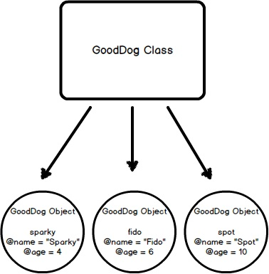

<h1 align="center"> [Object Oriented Ruby] </h1>

- [Source Link](https://launchschool.com/books/oo_ruby/read/the_object_model#whyobjectorientedprogramming)
# Introduction - Why OOP and Important Concepts in OOP

## Object Oriented Programming
Object Oriented Programming (OOP) is a programming [paradigm](https://en.wikipedia.org/wiki/Paradigm) that was created to deal with the growing complexity of large software systems.
- As applications grew in complexity and size, they became very difficult to maintain. 
- In OOP, areas of code that performed certain procedures are section off so that their programs could become the **interaction of many small parts**, as opposed to one massive blob of dependency.
  - As such, one small change at any point in the program would not trigger a ripple effect of errors due to dependencies throughout the entire program. 

## Encapsulation
Encapsulation describes the idea of bundling or combining the **states (data) and behaviors (operations)** that work together on that data into a **single entity**, e.g. an object.

Encapsulation also entails hiding functionality to make it unavailable to the rest of the codebase.
- Data protection is the main goal here, only with obvious intent can that data be manipulated.
- In Ruby, like other OO languages, achieves this by **creating objects** and **exposing public interfaces** (i.e. methods) to interact with those objects.

### Example: A Simple Banking Application
- The code for the app, at a minimum, must contain **data** about the bank accounts (account number, balance, account type) and the users (name, address, phone number). 
- The code must also contain **behaviors or operations** that use and manipulate that data. For instance, we should have operations that open an account, make withdrawals, and deposit new funds.
- One thing is evident here: the **data and operations** that you perform on your data are **related**.
  - You don't want to apply an operation intended for a bank account on a user's data. For example, it doesn't make much sense to withdraw funds from a user. Instead, you want to withdraw funds from the account, so you want to operate on an account.

## Polymorphism
Polymorphism is the ability for **different types of data** to respond to a **common interface**. 
- For instance, if we have a **method** that invokes the **move method** on its **argument**, we can pass the method **any type of argument** as long as the argument has a **compatible** move method. The object might represent a human, a cat, a jellyfish, or, conceivably, even a car or train. That is, it lets objects of different types respond to the same method invocation.

**"Poly"** stands for **"many"** and **"morph"** stands for **"forms"**. OOP gives us flexibility in using **pre-written code for new purposes**.

## Inheritance
The concept of inheritance is used in Ruby where **a class inherits** -- that is, acquires -- the **behaviors of another class**, referred to as the **superclass**. 
- Define basic classes with **large reusability** and smaller subclasses for more **fine-grained, detailed** behaviors.

Another way to apply **polymorphic** structure to Ruby programs is to use a **Module**. 
- Modules are similar to classes in that they **contain shared behavior**. However, you **cannot create an object** with a module. 
- A module must be **mixed in with a class** using the **include method invocation**. This is called a **mixin**. 
  - After mixing in a module, the behaviors declared in that module are available to the **class and its objects**.

`module Study`  
`end`

class MyClass  
&emsp;include Study  
end

my_obj = MyClass.new

# What are Objects?
In Ruby, everything is an object &rarr; Not exactly true!
- Anything that can be said to have a value **is** an object: that includes numbers, arrays, strings, and even classes and modules.
- However, **methods, blocks, and variables** stand out.

Note that **objects are created from classes.**
- Classes are molds and objects are the cast formed of the mold. 
- Two individual objects may contain different information from other objects, yet are instances of the same class.

Example:   
irb :001 > "hello".class  
=> String  
irb :002 > "world".class  
=> String  

# Classes Define Objects
Ruby defines the attributes and behaviors of its objects in classes. You can think of classes as **basic outlines** of what an object should be **made of** and what it should be able to **do**. 

To **define** a class, we use syntax similar to defining a method. 
- We replace the def with **class** and use the **CamelCase** naming convention to create the name.   
- We then use the reserved word **end** to finish the definition. 
- Ruby **file names** should be in **snake_case**, and reflect the class name. Thus, in the below example, the file name is **good_dog.rb** and the class name is **GoodDog**.

class GoodDog  
end  

sparky = GoodDog.new

In the above example, we created an instance of our **GoodDog** class and stored it in the variable **sparky**. We now have an object. 

We say that sparky is an object or instance of class GoodDog. 

This entire workflow of **creating a new object or instance from a class** is called **instantiation**, so we can also say that we've instantiated an object called sparky from the class GoodDog. 

The terminology in OOP is something you'll eventually get used to, but the important fact here is that an **object** is **returned** by calling the **class method new**. Take a look at Figure 3 to visualize what we're doing.

As you can see, defining and creating a new instance of a basic class is simple. But before we go any further showing you how to create more elaborate classes, let's talk about modules briefly.

# Modules